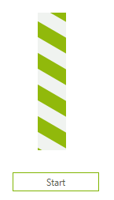
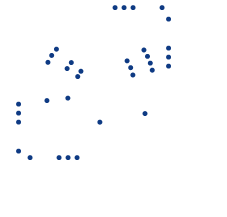

# Getting Started with WinForms WaitingBar

This tutorial will help you to quickly get started using the control.

## Adding Telerik Assemblies Using NuGet

To use `RadWaitingBar` when working with NuGet packages, install the `Telerik.UI.for.WinForms.AllControls` package. The [package target framework version may vary]().

Read more about NuGet installation in the [Install using NuGet Packages]() article.

>tip With the 2025 Q1 release, the Telerik UI for WinForms has a new licensing mechanism. You can learn more about it [here]().

## Adding Assembly References Manually

When dragging and dropping a control from the Visual Studio (VS) Toolbox onto the Form Designer, VS automatically adds the necessary assemblies. However, if you're adding the control programmatically, you'll need to manually reference the following assemblies:

* __Telerik.Licensing.Runtime__
* __Telerik.WinControls__
* __Telerik.WinControls.UI__
* __TelerikCommon__

The Telerik UI for WinForms assemblies can be install by using one of the available [installation approaches](). 

## Defining the RadWaitingBar

* To add a __RadWaitingBar__ to your form, drag a __RadWaitingBar__ from the toolbox onto the surface of the form designer.

* To programmatically add a __RadWaitingBar__ to a form, create a new instance of a __RadWaitingBar__, and add it to the form __Controls__ collection.

#### Adding a RadWaitingBar at runtime

<snippet id='track-and-status-controls-waitinggettingstarted-addwaitingbar-cs' />
<snippet id='track-and-status-controls-waitinggettingstarted-addwaitingbar-vb' />

The following tutorial illustrates how to start and stop the animation of __RadWaitingBar__:

1\. Place a __RadWaitingBar__ control and a __RadButton__ control on a form.

2\. Select the __RadWaitingBar__ control.

3\. In the __Properties__ window set the __WaitingDirection__ property to *Bottom*.

4\. Resize the __RadWaitingBar__ so that its height is larger than its width.

5\. Select the __RadButton__ control.

6\. Set the __Text__ property to *Start*.

7\. In the __Properties__ window click the events button.

8\. Double-click the __Click__ event.

9\. Replace the automatically-generated event handler with this code:

#### RadButton's Click event handler

<snippet id='track-and-status-controls-waitinggettingstarted-click-cs' />
<snippet id='track-and-status-controls-waitinggettingstarted-click-vb' />

10\. Press __F5__ to run the project.

11\. Click the *Start* button to start and stop the animation.

## Adding Indicator Elements programmatically

The following example demonstrates how to add __DotsLineWaitingBarIndicatorElements__ in a __RadWaitingBar__ with WaitingBarStyles.*DotsSpinner*:

<snippet id='track-and-status-controls-customizingradwaitingbar-addingindicators-cs' />
<snippet id='track-and-status-controls-customizingradwaitingbar-addingindicators-vb' />

## See Also

* [Structure]()	
* [Design Time]()

## Telerik UI for WinForms Learning Resources
* [Telerik UI for WinForms WaitingBar Component](https://www.telerik.com/products/winforms/waitingbar.aspx)
* [Getting Started with Telerik UI for WinForms Components](https://docs.telerik.com/devtools/winforms/getting-started/first-steps)
* [Telerik UI for WinForms Setup](https://docs.telerik.com/devtools/winforms/installation-and-upgrades/installing-on-your-computer)
* [Telerik UI for WinForms Converter](https://www.telerik.com/products/winforms/documentation/ai-coding-assistant/converter/converter)
* [Telerik UI for WinForms Visual Studio Templates](https://docs.telerik.com/devtools/winforms/visual-studio-integration/visual-studio-templates)
* [Deploy Telerik UI for WinForms Applications](https://docs.telerik.com/devtools/winforms/deployment-and-distribution/application-deployment)
* [Telerik UI for WinForms Virtual Classroom(Training Courses for Registered Users)](https://learn.telerik.com/learn/course/external/view/elearning/17/telerik-ui-for-winforms)
* [Telerik UI for WinForms License Agreement)](https://www.telerik.com/purchase/license-agreement/winforms-dlw-s)

