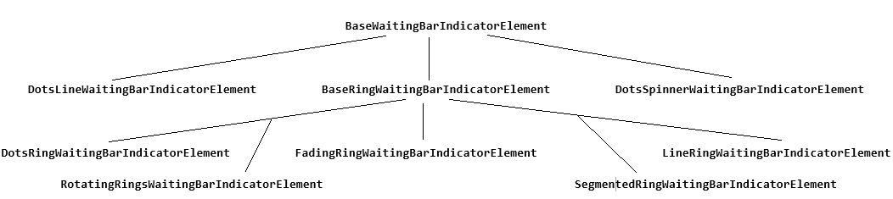
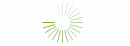

# Indicator Elements

All indicators inherit from __BaseWaitingBarIndicatorElement__ and define their own implementation of the __Animate__ and __ResetAnimation__ methods. 

>caption Fig.1 WaitingBar indicators' hierarchy

 

* __BaseWaitingBarIndicatorElement__: Represents the base indicator element.
	* __ElementCount__: Controls how many elements will be displayed.
	
	 
	
	* __ElementColor__: Gets or sets the color of the elements.
	
	

	* __ElementColor2__: Gets or sets the secondary color of the elements.
	
	

* __BaseRingWaitingBarIndicatorElement__: Represents the base ring indicator elements.
	* __InnerRadius__: Controls the inner radius.
	
	 
	* __Radius__: Controls the radius.
	
	 
	* __RotationDirection__: Determines the rotation direction.
		* *Clockwise*	 
		
			 
		* *CounterClockwise*	
		
		 	 

	* __ElementColor3__: Gets or sets the element back color3.
	
	

	* __ElementColor4__: Gets or sets the element back color4.

	* __ElementGradientPercentage__: Gets or sets the element gradient percentage.
	

	* __ElementGradientPercentage2__: Gets or sets the element gradient percentage.
	

* __DotsLineWaitingBarIndicatorElement__: Represents accelerating dots moving in a line.

* __DotsRingWaitingBarIndicatorElement__: Represents accelerating dots moving in a ring.

* __DotsSpinnerWaitingBarIndicatorElement__: Represents accelerating dots like spinner.

* __FadingRingWaitingBarIndicatorElement__: Represents accelerating fading ring.

* __LineRingWaitingBarIndicatorElement__: Represents accelerating lines moving in a ring.

	 

	* __LineThickness__: Controls how thick the lines are.
	
	 

* __RotatingRingsWaitingBarIndicatorElement__: Represents rotating rings.

* __SegmentedRingWaitingBarIndicatorElement__: Represents accelerating segments moving in a ring.

   
# See Also

* [Structure]()	
* [Design Time]()
* [Getting Started]()	
* [Waiting Styles]()	
* [Properties, Methods and Events]()	
