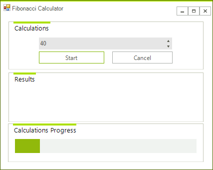
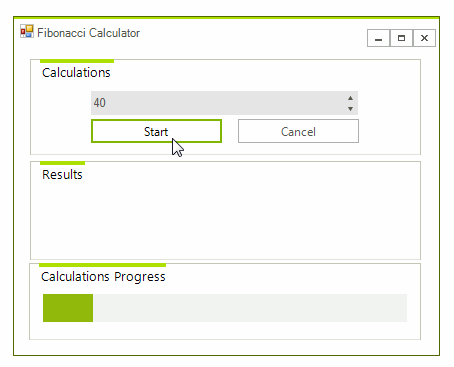
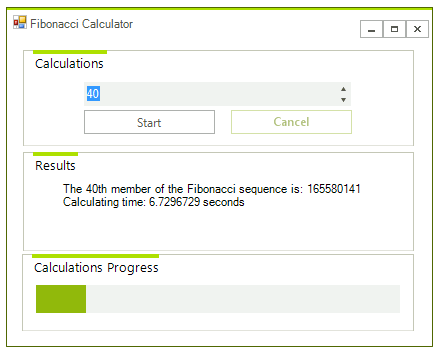

# Using WaitingBar with a Background Worker

__RadWaitingBar__ is a useful control for indicating that a long-running operation is undergoing. When using this control, however, many users face a similar issue: once the time-consuming operation is started, the control does not move its indicators and literally freezes. Such cases occur when the long-running operation is executed on the same thread as the __RadWaitingBar__ waiting process: the primary UI Thread. The operation does not allow the form to update its UI and as a result the control does not perform any waiting animation.

One obvious solution is to start the time-consuming operation in a new thread. The following example illustrates how to achieve this through a BackgroundWorker.

## BackgroundWorker solution

The aim of the sample application is to calculate numbers of the Fibonacci sequence. In a straight-forward scenario, the user selects the position of the Fibonacci number through a __RadSpinEditor__ and clicks the *Start* __RadButton__ to trigger the time-consuming operation. While the calculations are undergoing the __RadWaitingBar__ smoothly animates its waiting indicators and the __RadForm__ remains responsive. Once the number is calculated, the result is displayed and the __RadWaitingBar__ control is stopped. Below you will find snippets and comments which provide a detailed description of the sample application. 

>caption Fig.1 Fibonacci example

1\. When the form is loaded the BackgroundWorker instance should be initialized. Additionally, you should subscribe to two of its events: __DoWork__ and __RunWorkerCompleted__.

<snippet id='track-and-status-controls-bgworkerform-initialization-cs' />
<snippet id='track-and-status-controls-bgworkerform-initialization-vb' />

2\. When the user clicks the *Start* __RadButton__, you should run the BackgroundWorker through the __RunWorkerAsync__ method and, also, start the __RadWaitingBar__ waiting process using the __StartWaiting__ method.

<snippet id='track-and-status-controls-bgworkerform-startingworker-cs' />
<snippet id='track-and-status-controls-bgworkerform-startingworker-vb' />

>caption Fig.2 Calculation in progress

3\. In the __DoWork__ event handler you should execute the time-consuming operation, i.e. calculate the required Fibonacci number.

<snippet id='track-and-status-controls-bgworkerform-working-cs' />
<snippet id='track-and-status-controls-bgworkerform-working-vb' />

>note If you want to interupt the long-lasting operation, you can click the **Cancel** button where the BackgroundWorker.**CancelAsync** method is called.

4\. When the long-running operation has completed, you should stop the __RadWaitingBar__ control waiting process through the __StopWaiting__ method. Additionally, you should display the result to the user.

<snippet id='track-and-status-controls-bgworkerform-workcompleted-cs' />
<snippet id='track-and-status-controls-bgworkerform-workcompleted-vb' />

>caption Fig.3 Result

