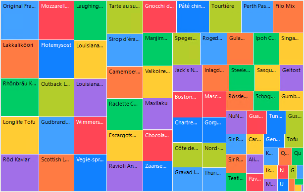
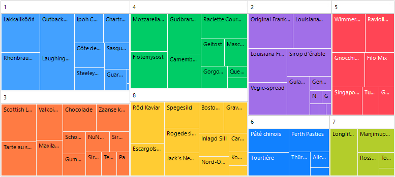
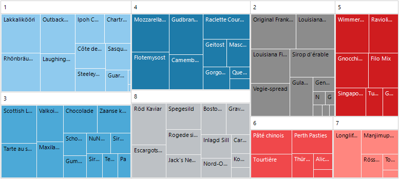
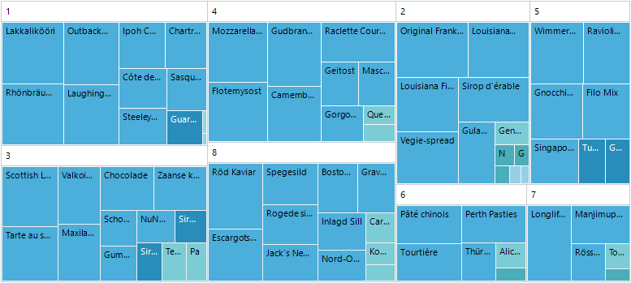
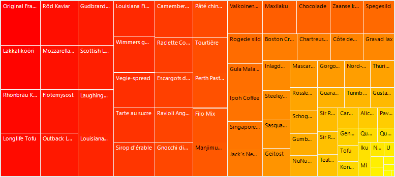
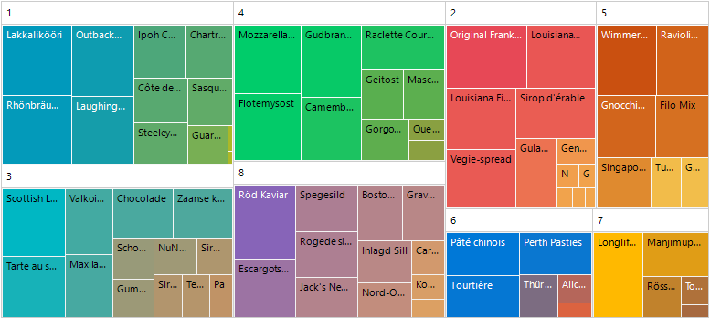

# Colorizers

This topic aims to get you familiar with all types of colorizers you may use to change the visualization of RadTreeMap. 

Let's get started with creating a sample RadTreeMap, bound to the Northwind.Products table. You can read more on this topic in the [Data Binding]() article. The result is shown bellow: 



By default, RadTreeMap uses a **PaletteColorizer** with a default palette.

### PaletteColorizer

Colorizes RadTreeMap per predefined collection of 8 palette colors. Each item in different groups is colored the same way.

>caption Grouped RadTreeMap with PaletteColorizer



The available palettes for the PaletteColorizer are:

* Arctic
* Autumn
* Cold
* Flower
* Forest
* Grayscale
* Ground
* Lilac
* Metro
* Natural
* Pastel
* Rainbow
* Spring
* Summer
* Warm
* Windows8
* Sun
* Office2013
* VisualStudio2013
* Green
* Office2016
* Material
* Fluent
* Crystal
* VisualStudio2019

#### Apply PaletteColorizer

{{source=..\SamplesCS\TreeMap\TreeMapGettingStarted.cs region=PaletteColorizer}} 
{{source=..\SamplesVB\TreeMap\TreeMapGettingStarted.vb region=PaletteColorizer}} 

````C#

PaletteColorizer paletteColorizer = new PaletteColorizer();
paletteColorizer.Palette = TreeMapPalette.Arctic;
this.radTreeMap1.Colorizer = paletteColorizer;        

````
````VB.NET

Dim paletteColorizer As PaletteColorizer = New PaletteColorizer()
paletteColorizer.Palette = TreeMapPalette.Arctic
Me.radTreeMap1.Colorizer = paletteColorizer

````

{{endregion}}

>caption TreeMapPalette.Arctic



### RangeColorizer

This RangeColorizer contains a set of ranges defined by the **Stops** collection of values. It chooses the color to be applied according to the TreeMapDataItem's value and the stops that define the range.

>note If no values are added to the **Stops** collection, the RangeColorizer gets the minimum/maximum values among the items and calculates default ranges.



{{source=..\SamplesCS\TreeMap\TreeMapGettingStarted.cs region=RangeColorizer}} 
{{source=..\SamplesVB\TreeMap\TreeMapGettingStarted.vb region=RangeColorizer}} 

````C#
            
RangeColorizer rangeColorizer = new RangeColorizer();
rangeColorizer.Palette = TreeMapPalette.Cold;
rangeColorizer.Stops.AddRange(new List<double>() { 5, 10, 20, 25, 60 });
this.radTreeMap1.Colorizer = rangeColorizer; 

````
````VB.NET
Dim rangeColorizer As RangeColorizer = New RangeColorizer()
rangeColorizer.Palette = TreeMapPalette.Cold
rangeColorizer.Stops.AddRange(New List(Of Double)() From {
    5,
    10,
    20,
    25,
    60
})
Me.radTreeMap1.Colorizer = rangeColorizer

````

{{endregion}}

>Each Stop value can be absolute or relative (between 0 and 1) depending on the IsAbsolute property value. This may be useful for cases when half of the items need to be colored in one color, and the rest of them in another. Just add Stops 0, 0.5, 1 and thus two ranges will be defined: 0-0.5 and 0.5-1. Two palette colorw will be used in this case.

### GradientColorizer

A colorizer, which contains a set of gradient stops. It chooses the color to be applied according to the TreeMapDataItem's value and colorizer's gradient stops. Values with higher values than the maximum will be colored as the **StartColor** and values with lower values than the minimum will be colored as the **EndColor**.  



{{source=..\SamplesCS\TreeMap\TreeMapGettingStarted.cs region=GradientColorizer}} 
{{source=..\SamplesVB\TreeMap\TreeMapGettingStarted.vb region=GradientColorizer}} 

````C#

GradientColorizer gradientColorizer = new GradientColorizer();
gradientColorizer.StartColor = Color.Red;
gradientColorizer.EndColor = Color.Yellow;
this.radTreeMap1.Colorizer = gradientColorizer;         
 
````
````VB.NET

Dim gradientColorizer As GradientColorizer = New GradientColorizer()
gradientColorizer.StartColor = System.Drawing.Color.Red
gradientColorizer.EndColor = System.Drawing.Color.Yellow
Me.radTreeMap1.Colorizer = gradientColorizer

````

{{endregion}} 

In case of grouping, the GradientColorizer offers:

* **StartPalette** - Defines the start colors for each group.

* **EndPalette** - Defines the end colors for each group.

>note The **StartColor** and **EndColor** properties have default values coming from the first color defined in the two palettes respectively.

{{source=..\SamplesCS\TreeMap\TreeMapGettingStarted.cs region=GroupedGradient}} 
{{source=..\SamplesVB\TreeMap\TreeMapGettingStarted.vb region=GroupedGradient}} 

````C#

GradientColorizer groupGradientColorizer = new GradientColorizer();
groupGradientColorizer.StartPalette = TreeMapPalette.Fluent;
groupGradientColorizer.EndPalette = TreeMapPalette.Forest;
this.radTreeMap1.Colorizer = groupGradientColorizer;       
 
````
````VB.NET

Dim groupGradientColorizer As GradientColorizer = New GradientColorizer()
groupGradientColorizer.StartPalette = TreeMapPalette.Fluent
groupGradientColorizer.EndPalette = TreeMapPalette.Forest
Me.radTreeMap1.Colorizer = groupGradientColorizer

````

{{endregion}} 


 
 
# See Also

* [Structure]() 

* [Layout Strategies]()

* [Getting Started]()

* [Data Binding]()

