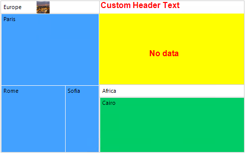
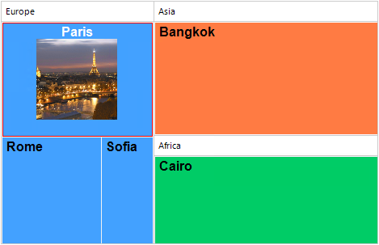

# Customizing Appearance

RadTreeMap offers several events that are responsible for painting the data and group items:

### GroupPainting

It is fired just before a group is being painted. The base logic can be canceled (Handled=true) if the default painting shouldn't be performed and a custom drawing is required. The **TreeMapGroupPaintingEventArgs** gives you access to:

* **Group**: The **TreeMapDataItemGroup** that is about to be painted.
* **Graphics**: Gets the System.Drawing.Graphics object. 
* **Handled**: Determines whether the group should be painted.
* **Bounds**: Gets the Rectangle bounds of the group.
* **BackColor**: Gets or sets the group background color.
* **ForeColor**: Gets or sets the group foreground color.
* **BorderColor**: Gets or sets the group border color.
* **Font**: Gets or sets the group font.
* **Text**: Gets or sets the group text.
* **TextAlignment**: Gets or sets the text alignment.
* **HeaderRect**: Gets the header text rectangle.

### GroupPainted

It is fired right after a group is already painted. It is appropriate if you need to perform some extra painting over the already drawn group. The **TreeMapGroupPaintedEventArgs** gives you access to:
	
* **Group**: The **TreeMapDataItemGroup** that was just painted.
* **Graphics**: Gets the System.Drawing.Graphics object. 
* **Bounds**: Gets the Rectangle bounds of the group.

>note If the **GroupPainting** is **Handled**, the **GroupPainted** wouldn't be fired. 

{{source=..\SamplesCS\TreeMap\TreeMapGettingStarted.cs region=GroupPainting}} 
{{source=..\SamplesVB\TreeMap\TreeMapGettingStarted.vb region=GroupPainting}} 

````C#

private void RadTreeMap1_GroupPainting(object sender, TreeMapGroupPaintingEventArgs e)
{
    if (e.Group.Text == "Asia")
    {
        e.Handled = true;

        e.Graphics.DrawString("Custom Header Text", itemsFont, Brushes.Red, e.HeaderRect);
        Rectangle contentRectangle = new Rectangle(new Point(e.Bounds.X, e.HeaderRect.Bottom),
            new Size(e.Bounds.Width, e.Bounds.Height - e.HeaderRect.Height));
        e.Graphics.FillRectangle(Brushes.Yellow, contentRectangle);
        e.Graphics.DrawString("No data", itemsFont, Brushes.Red,
            new Point(contentRectangle.X + contentRectangle.Width / 3,
            contentRectangle.Y + contentRectangle.Height / 2));

    }
}

private void RadTreeMap1_GroupPainted(object sender, TreeMapGroupPaintedEventArgs e)
{
    if (e.Group.Text == "Europe")
    {
        Image img = new Bitmap(Properties.Resources.Paris, new Size(this.radTreeMap1.TreeMapElement.GroupHeaderHeight,
            this.radTreeMap1.TreeMapElement.GroupHeaderHeight));
        Point imageLocation = new Point(e.Bounds.X + e.Bounds.Width / 2 - img.Width, e.Bounds.Y);
        e.Graphics.DrawImage(img, imageLocation);
    }
}
    

````
````VB.NET

Private Sub RadTreeMap1_GroupPainting(ByVal sender As Object, ByVal e As TreeMapGroupPaintingEventArgs)
    If e.Group.Text = "Asia" Then
        e.Handled = True
        e.Graphics.DrawString("Custom Header Text", itemsFont, Brushes.Red, e.HeaderRect)
        Dim contentRectangle As Rectangle = New Rectangle(New Point(e.Bounds.X, e.HeaderRect.Bottom),
                                                          New Size(e.Bounds.Width, e.Bounds.Height - e.HeaderRect.Height))
        e.Graphics.FillRectangle(Brushes.Yellow, contentRectangle)
        e.Graphics.DrawString("No data", itemsFont, Brushes.Red,
                              New Point(contentRectangle.X + contentRectangle.Width / 3,
                                        contentRectangle.Y + contentRectangle.Height / 2))
    End If
End Sub

Private Sub RadTreeMap1_GroupPainted(ByVal sender As Object, ByVal e As TreeMapGroupPaintedEventArgs)
    If e.Group.Text = "Europe" Then
        Dim img As Image = New Bitmap(My.Resources.Paris, New Size(Me.radTreeMap1.TreeMapElement.GroupHeaderHeight,
                                                                   Me.radTreeMap1.TreeMapElement.GroupHeaderHeight))
        Dim imageLocation As Point = New Point(e.Bounds.X + e.Bounds.Width / 2 - img.Width, e.Bounds.Y)
        e.Graphics.DrawImage(img, imageLocation)
    End If
End Sub
 

````

{{endregion}}




### ItemPainting 

It gets fired before an item is being painted. The base logic can be canceled (Handled=true) if the default painting shouldn't be performed and a custom drawing is required. The **TreeMapItemPaintingEventArgs** gives you access to:

* **Item**: The **TreeMapDataItem** that is about to be painted.
* **Graphics**: Gets the System.Drawing.Graphics object. 
* **Handled**: Determines whether the item should be painted.
* **Bounds**: Gets the Rectangle bounds of the item.
* **BackColor**: Gets or sets the item background color.
* **ForeColor**: Gets or sets the item foreground color.
* **BorderColor**: Gets or sets the item border color.
* **Font**: Gets or sets the item font.
* **Text**: Gets or sets the item text.
* **TextAlignment**: Gets or sets the text alignment. 

### ItemPainted 
 
It is fired right after an item is already painted. It is appropriate if you need to perform some extra painting over the already drawn item. The **TreeMapItemPaintedEventArgs** gives you access to:

* **Item**: The **TreeMapDataItem** that was just painted.
* **Graphics**: Gets the System.Drawing.Graphics object. 
* **Bounds**: Gets the Rectangle bounds of the item.



{{source=..\SamplesCS\TreeMap\TreeMapGettingStarted.cs region=ItemPainting}} 
{{source=..\SamplesVB\TreeMap\TreeMapGettingStarted.vb region=ItemPainting}} 

````C#

Font itemsFont = new Font("Arial", 12f, FontStyle.Bold);
private void RadTreeMap1_ItemPainting(object sender, TreeMapItemPaintingEventArgs e)
{
    e.Font = itemsFont;
    if (e.Item.Text == "Paris")
    {
        e.ForeColor = Color.White;
        e.TextAlignment = ContentAlignment.TopCenter;
        e.BorderColor = Color.Red;
    }
    else
    {
        e.ForeColor = Color.Black;
        e.TextAlignment = ContentAlignment.TopLeft;
        e.BorderColor = Color.Transparent;
    }
}

private void RadTreeMap1_ItemPainted(object sender, TreeMapItemPaintedEventArgs e)
{
    if (e.Item.Text == "Paris")
    {
        Image img = new Bitmap(Properties.Resources.Paris, new Size(100, 100));
        Point imageLocation = new Point(e.Bounds.X + e.Bounds.Width / 2 - img.Width / 2, e.Bounds.Y + 20);
        e.Graphics.DrawImage(img, imageLocation);
    }
}   

````
````VB.NET

Private itemsFont As Font = New Font("Arial", 12.0F, FontStyle.Bold)

Private Sub RadTreeMap1_ItemPainting(ByVal sender As Object, ByVal e As TreeMapItemPaintingEventArgs)
    e.Font = itemsFont

    If e.Item.Text = "Paris" Then
        e.ForeColor = Color.White
        e.TextAlignment = ContentAlignment.TopCenter
        e.BorderColor = Color.Red
    Else
        e.ForeColor = Color.Black
        e.TextAlignment = ContentAlignment.TopLeft
        e.BorderColor = Color.Transparent
    End If
End Sub

Private Sub RadTreeMap1_ItemPainted(ByVal sender As Object, ByVal e As TreeMapItemPaintedEventArgs)
    If e.Item.Text = "Paris" Then
        Dim img As Image = New Bitmap(My.Resources.Paris, New Size(100, 100))
        Dim imageLocation As Point = New Point(e.Bounds.X + e.Bounds.Width / 2 - img.Width / 2, e.Bounds.Y + 20)
        e.Graphics.DrawImage(img, imageLocation)
    End If
End Sub 

````

{{endregion}} 

>note If the **ItemPainting** is **Handled**, the **ItemPainted** wouldn't be fired. 

# See Also

* [Structure]() 

* [Layout Strategies]()

* [Getting Started]()

* [Data Binding]()

