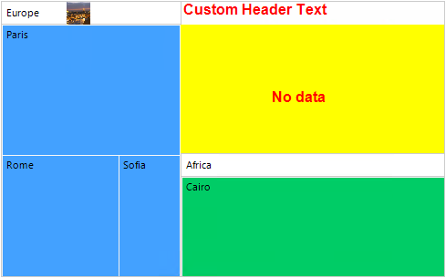
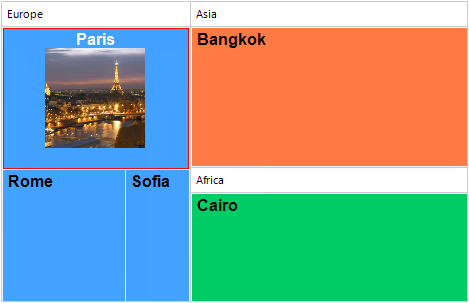

# Customizing Appearance

RadTreeMap offers several events that are responsible for painting the data and group items:

### GroupPainting

It is fired just before a group is being painted. The base logic can be canceled (Handled=true) if the default painting shouldn't be performed and a custom drawing is required. The **TreeMapGroupPaintingEventArgs** gives you access to:

* **Group**: The **TreeMapDataItemGroup** that is about to be painted.
* **Graphics**: Gets the System.Drawing.Graphics object. 
* **Handled**: Determines whether the group should be painted.
* **Bounds**: Gets the Rectangle bounds of the group.
* **BackColor**: Gets or sets the group background color.
* **ForeColor**: Gets or sets the group foreground color.
* **BorderColor**: Gets or sets the group border color.
* **Font**: Gets or sets the group font.
* **Text**: Gets or sets the group text.
* **TextAlignment**: Gets or sets the text alignment.
* **HeaderRect**: Gets the header text rectangle.

### GroupPainted

It is fired right after a group is already painted. It is appropriate if you need to perform some extra painting over the already drawn group. The **TreeMapGroupPaintedEventArgs** gives you access to:
	
* **Group**: The **TreeMapDataItemGroup** that was just painted.
* **Graphics**: Gets the System.Drawing.Graphics object. 
* **Bounds**: Gets the Rectangle bounds of the group.

>note If the **GroupPainting** is **Handled**, the **GroupPainted** and **ItemPainting** events wouldn't be fired. 

<snippet id='treemap-treemapgettingstarted-grouppainting-cs' />
<snippet id='treemap-treemapgettingstarted-grouppainting-vb' />

### ItemPainting 

It gets fired before an item is being painted. The base logic can be canceled (Handled=true) if the default painting shouldn't be performed and a custom drawing is required. The **TreeMapItemPaintingEventArgs** gives you access to:

* **Item**: The **TreeMapDataItem** that is about to be painted.
* **Graphics**: Gets the System.Drawing.Graphics object. 
* **Handled**: Determines whether the item should be painted.
* **Bounds**: Gets the Rectangle bounds of the item.
* **BackColor**: Gets or sets the item background color.
* **ForeColor**: Gets or sets the item foreground color.
* **BorderColor**: Gets or sets the item border color.
* **Font**: Gets or sets the item font.
* **Text**: Gets or sets the item text.
* **TextAlignment**: Gets or sets the text alignment. 

### ItemPainted 
 
It is fired right after an item is already painted. It is appropriate if you need to perform some extra painting over the already drawn item. The **TreeMapItemPaintedEventArgs** gives you access to:

* **Item**: The **TreeMapDataItem** that was just painted.
* **Graphics**: Gets the System.Drawing.Graphics object. 
* **Bounds**: Gets the Rectangle bounds of the item.

<snippet id='treemap-treemapgettingstarted-itempainting-cs' />
<snippet id='treemap-treemapgettingstarted-itempainting-vb' />

>note If the **ItemPainting** is **Handled**, the **ItemPainted** wouldn't be fired. 

# See Also

* [Structure]() 

* [Layout Strategies]()

* [Getting Started]()

* [Data Binding]()

