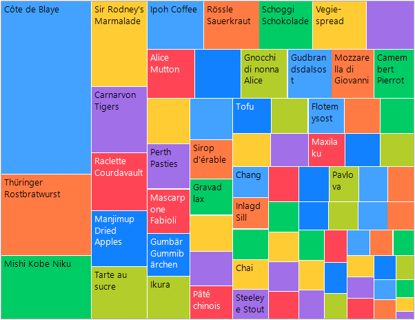
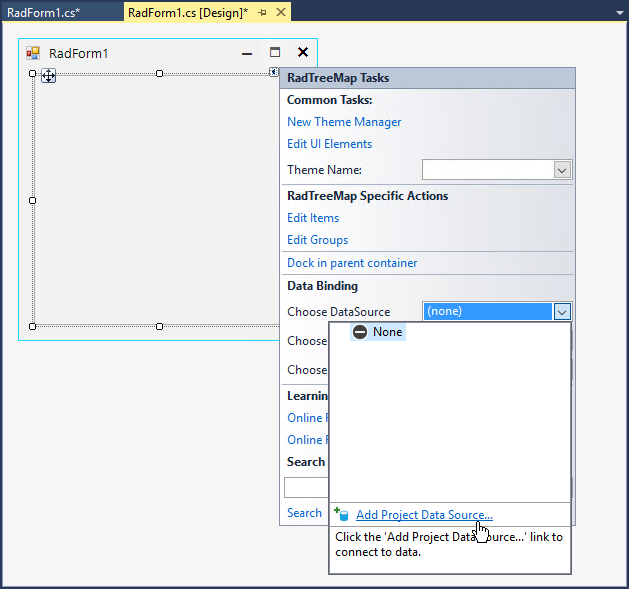
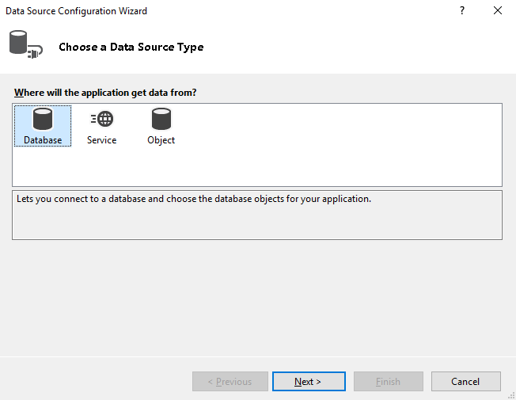
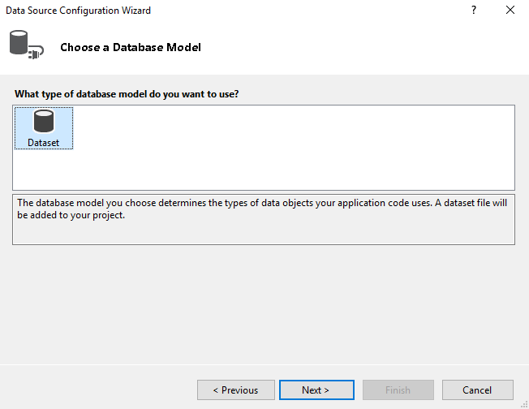
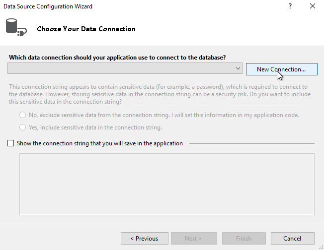
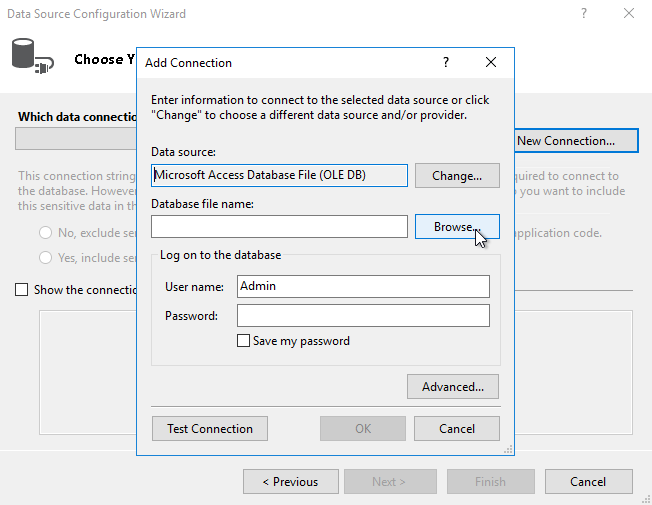
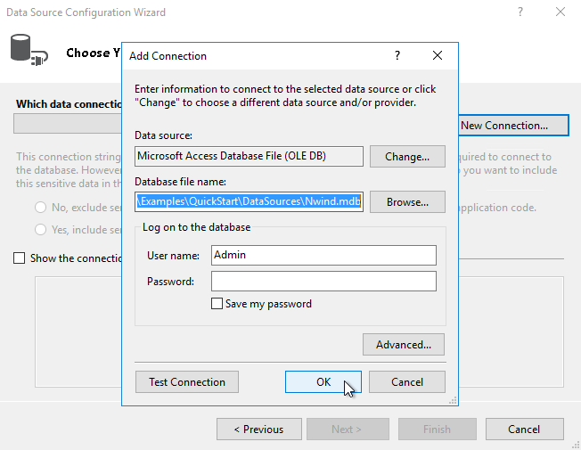
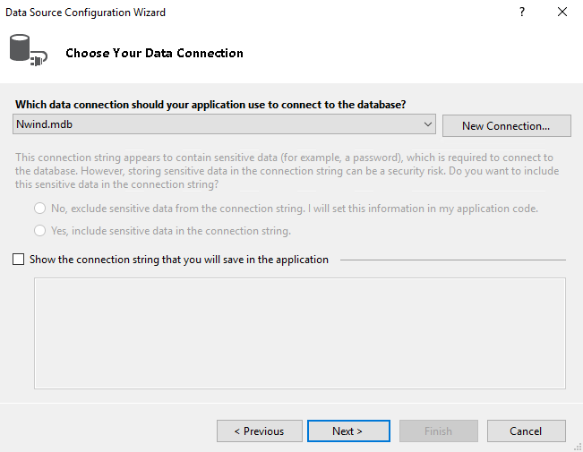
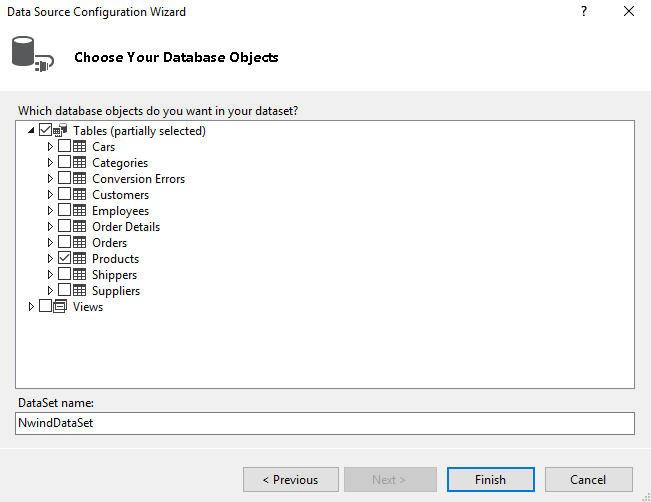
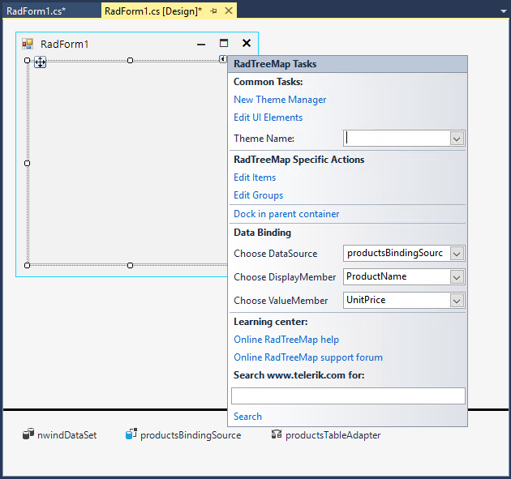

# Data Binding

Data binding is a mechanism for automatic population of the RadTreeMap with items, based on the provided data structure. Three properties control the data binding:

* **DataSource** - specifies the data structure to be bound.

* **DisplayMember** - specifies the particular field in the data source which will be used from the items in RadTreeMap for their Text.

* **ValueMember** - specifies the particular field in the data source which controls the value for each item.

**RadTreeMap** supports data binding either at design time or at run time. Both of the approaches will lead to the same result:



## Run Time

{{source=..\SamplesCS\TreeMap\TreeMapGettingStarted.cs region=Bind}} 
{{source=..\SamplesVB\TreeMap\TreeMapGettingStarted.vb region=Bind}} 

````C#
         
this.radTreeMap1.DisplayMember = "ProductName";
this.radTreeMap1.ValueMember = "ProductID";
this.radTreeMap1.DataSource = this.productsBindingSource;

````
````VB.NET

Me.radTreeMap1.DisplayMember = "ProductName"
Me.radTreeMap1.ValueMember = "ProductID"
Me.radTreeMap1.DataSource = Me.productsBindingSource

````

{{endregion}} 
 
 
## Design Time

It is possible to specify the **DataSource**, **DisplayMember**, **ValueMember** properties via the Smart Tag. The following tutorial demonstrates how to bind the tree map control to the Northwind.Products table:




















 
# See Also

* [Structure]() 

* [Layout Strategies]()

* [Getting Started]()

* [Unbound Mode]()


