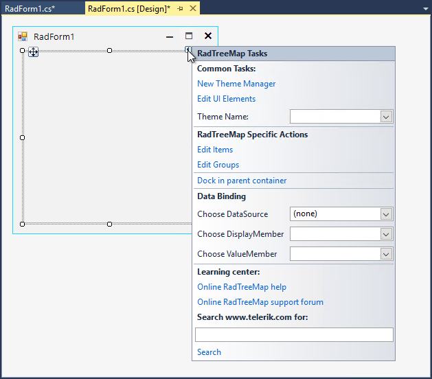
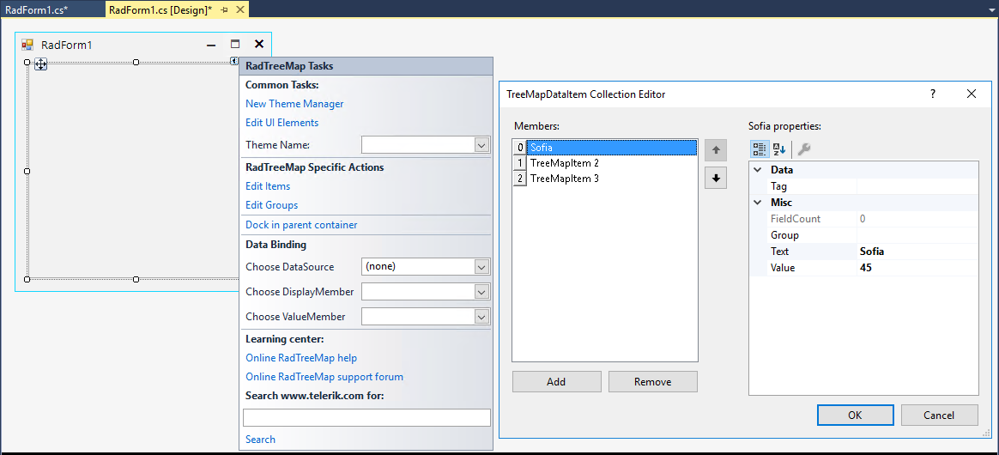
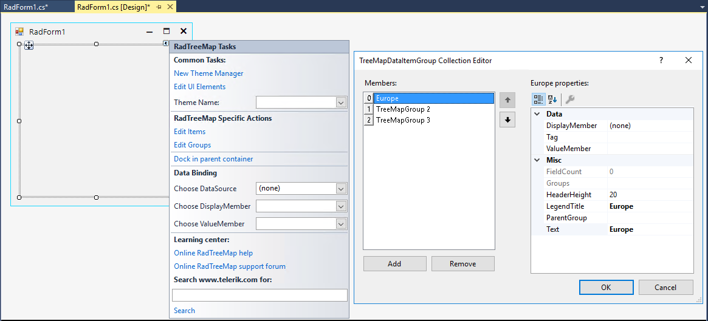

# Design Time

To start using **RadTreeMap**, just drag it from the toolbox and drop it onto the form.

## Smart Tag

Select RadTreeMap and click the small arrow on the top right position in order to open the Smart Tag.

* **Common Tasks**

	* New Theme Manager: Adds a new RadThemeManager component to the form.

	* Edit UI elements: Opens a dialog that displays the Element Hierarchy Editor. This editor lets you browse all the elements in the control.

	* Theme Name: Select a theme name from the drop down list of themes available for that control. Selecting a theme allows you to change all aspects of the controls visual style at one time.

* **RadTreeMap Specific Actions**

	* Edit Items - allows adding tree map items at design time.

	
	
	* Edit Groups - allows adding tree map groups at design time. 

	

* **Data Binding** - It is possible to bind RadTreeMap at design time by specifying the DataSource, ValueMember and DisplayMember properties. The DisplayMember property specifies the particular field in the data source which will be used from the items in RadTreeMap for their Text. The ValueMember property specifies the particular field in the data source which is used as a value for the item.

RadTreeMap supports data binding either at design time or at run time.

* **Learning Center**: Navigate to the Telerik help, code library projects or support forum.

* **Search**: Search the Telerik site for a given string.

# See Also

* [Structure]() 

* [Layout Strategies]()

* [Getting Started]()

