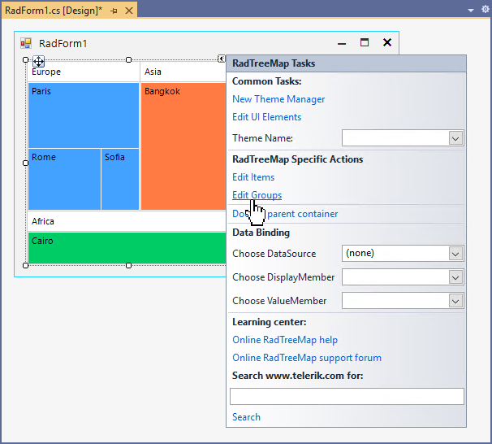
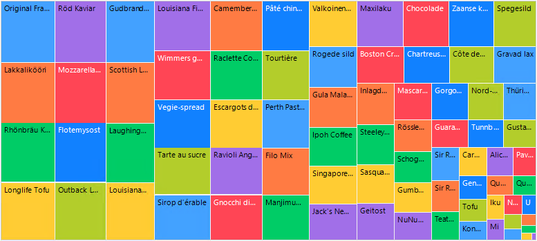
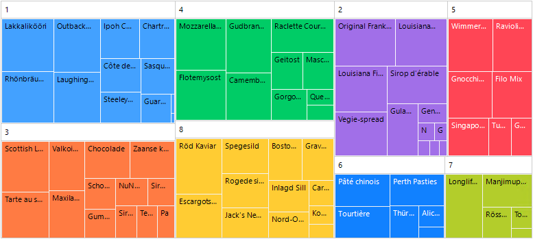

# Grouping

**RadTreeMap** supports grouping for its data items combining the pieces belonging to the same group with a similar color/palette. 

When using [unbound mode](), it is necessary to add a **TreeMapDataItemGroup** specifying the group **Text** and **LegendTitle**. Then, specify the **Group** property for each **TreeMapDataItem**. The group items can be added either at design time via the *TreeMapDataItemGroup Collection Editor* or at run time. Read more in the following help article: [Unbound Mode](). 

>caption Adding Groups at Design Time



When using [bound mode](), once the **RadTreeMap** is populated with data, it is possible to add a new **GroupDescriptor** to the **GroupDescriptors** collection:

>caption RadTreeMap with no grouping



>caption RadTreeMap grouped by CategoryID 



{{source=..\SamplesCS\TreeMap\TreeMapGettingStarted.cs region=Grouping}} 
{{source=..\SamplesVB\TreeMap\TreeMapGettingStarted.vb region=Grouping}} 

````C#

this.radTreeMap1.DisplayMember = "ProductName";
this.radTreeMap1.ValueMember = "ProductID";
this.radTreeMap1.DataSource = this.productsBindingSource;
this.radTreeMap1.GroupDescriptors.Add("CategoryID", ListSortDirection.Descending);          

````
````VB.NET

Me.radTreeMap1.DisplayMember = "ProductName"
Me.radTreeMap1.ValueMember = "ProductID"
Me.radTreeMap1.DataSource = Me.productsBindingSource
Me.radTreeMap1.GroupDescriptors.Add("CategoryID", ListSortDirection.Ascending)

````

{{endregion}} 

 
# See Also

* [Structure]() 

* [Layout Strategies]()

* [Colorizers]()

