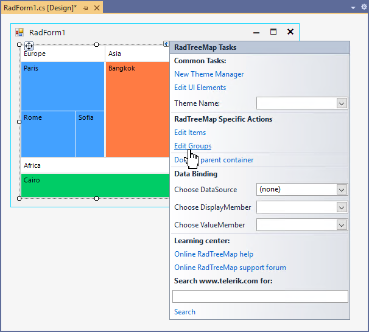
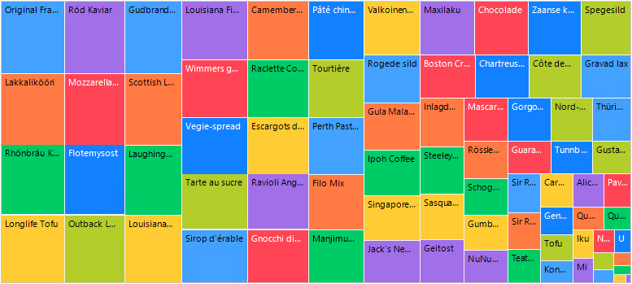
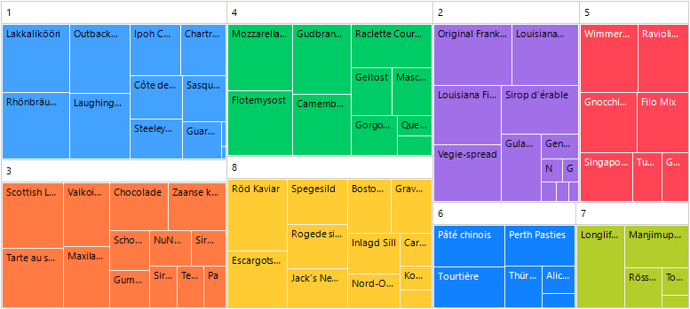

# Grouping

**RadTreeMap** supports grouping for its data items combining the pieces belonging to the same group with a similar color/palette. 

When using [unbound mode](), it is necessary to add a **TreeMapDataItemGroup** specifying the group **Text** and **LegendTitle**. Then, specify the **Group** property for each **TreeMapDataItem**. The group items can be added either at design time via the *TreeMapDataItemGroup Collection Editor* or at run time. Read more in the following help article: [Unbound Mode](). 

>caption Adding Groups at Design Time

When using [bound mode](), once the **RadTreeMap** is populated with data, it is possible to add a new **GroupDescriptor** to the **GroupDescriptors** collection:

>caption RadTreeMap with no grouping

>caption RadTreeMap grouped by CategoryID 

<snippet id='treemap-treemapgettingstarted-grouping-cs' />
<snippet id='treemap-treemapgettingstarted-grouping-vb' />

# See Also

* [Structure]() 

* [Layout Strategies]()

* [Colorizers]()

