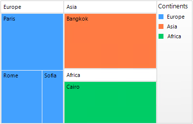
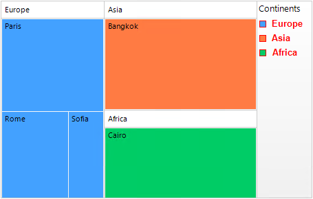

# Legend

RadTreeMap has built-in support for a legend – descriptions about the treemap data on the plot. The **ShowLegend** property of **RadTreeMap** controls whether the legend is visible or not. The default value is *false*. The legend supports showing a legend title, which text can be set via the **LegendTitle** property of the TreeMapDataItemGroup. A sample approach to populate RadTreeMap with data is demonstrated in the [Unbound Mode]() article >> *Populating with Data at Run Time* section. 

>caption RadTreeMap's legend



{{source=..\SamplesCS\TreeMap\TreeMapGettingStarted.cs region=Legend}} 
{{source=..\SamplesVB\TreeMap\TreeMapGettingStarted.vb region=Legend}} 

````C#
 
this.radTreeMap1.ShowLegend = true;
this.radTreeMap1.TreeMapElement.LegendPosition = RadPosition.Right;
this.radTreeMap1.TreeMapElement.LegendElement.LegendTitle = "Continents";
this.radTreeMap1.TreeMapElement.LegendElement.PanelElement.Orientation = Orientation.Vertical;           

````
````VB.NET

Me.radTreeMap1.ShowLegend = True
Me.radTreeMap1.TreeMapElement.LegendPosition = RadPosition.Right
Me.radTreeMap1.TreeMapElement.LegendElement.LegendTitle = "Continents"
Me.radTreeMap1.TreeMapElement.LegendElement.PanelElement.Orientation = Orientation.Vertical


````

{{endregion}} 

The TreeMapElement.LegendElement.**VisualItemCreating** event allows you to create custom legend elements or customize the default ones:

#### Customize the default LegendItemElement

{{source=..\SamplesCS\TreeMap\TreeMapGettingStarted.cs region=FormattingLegendItems}} 
{{source=..\SamplesVB\TreeMap\TreeMapGettingStarted.vb region=FormattingLegendItems}} 

````C#
 
Font f = new Font("Arial", 10f, FontStyle.Bold);
private void LegendElement_VisualItemCreating(object sender, 
    Telerik.WinControls.UI.TreeMap.LegendItemElementCreatingEventArgs e)
{
    Telerik.WinControls.UI.TreeMap.LegendItemElement legendElement = 
        new Telerik.WinControls.UI.TreeMap.LegendItemElement(e.GroupItem);
    legendElement.Font = f;
    legendElement.TitleElement.ForeColor = Color.Red;
    legendElement.MarkerElement.DrawBorder = true;
    legendElement.MarkerElement.BorderBoxStyle = BorderBoxStyle.SingleBorder;
    legendElement.MarkerElement.BorderColor = Color.Red;
    legendElement.MarkerElement.BorderWidth = 1;
    e.ItemElement = legendElement;
}         

````
````VB.NET

Private f As Font = New Font("Arial", 10.0F, FontStyle.Bold)

Private Sub LegendElement_VisualItemCreating(ByVal sender As Object,
                  ByVal e As Telerik.WinControls.UI.TreeMap.LegendItemElementCreatingEventArgs)
    Dim legendElement As Telerik.WinControls.UI.TreeMap.LegendItemElement =
        New Telerik.WinControls.UI.TreeMap.LegendItemElement(e.GroupItem)
    legendElement.Font = f
    legendElement.TitleElement.ForeColor = Color.Red
    legendElement.MarkerElement.DrawBorder = True
    legendElement.MarkerElement.BorderBoxStyle = BorderBoxStyle.SingleBorder
    legendElement.MarkerElement.BorderColor = Color.Red
    legendElement.MarkerElement.BorderWidth = 1
    e.ItemElement = legendElement
End Sub

````

{{endregion}} 



 
# See Also

* [Structure]() 

* [Layout Strategies]()

* [Colorizers]()

