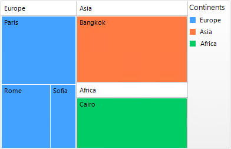
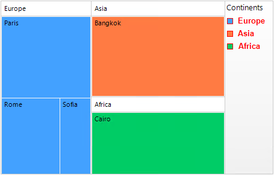

# Legend

RadTreeMap has built-in support for a legend – descriptions about the treemap data on the plot. The **ShowLegend** property of **RadTreeMap** controls whether the legend is visible or not. The default value is *false*. The legend supports showing a legend title, which text can be set via the **LegendTitle** property of the TreeMapDataItemGroup. A sample approach to populate RadTreeMap with data is demonstrated in the [Unbound Mode]() article >> *Populating with Data at Run Time* section. 

>caption RadTreeMap's legend

<snippet id='treemap-treemapgettingstarted-legend-cs' />
<snippet id='treemap-treemapgettingstarted-legend-vb' />

The TreeMapElement.LegendElement.**VisualItemCreating** event allows you to create custom legend elements or customize the default ones:

#### Customize the default LegendItemElement

<snippet id='treemap-treemapgettingstarted-formattinglegenditems-cs' />
<snippet id='treemap-treemapgettingstarted-formattinglegenditems-vb' />

 
# See Also

* [Structure]() 

* [Layout Strategies]()

* [Colorizers]()

