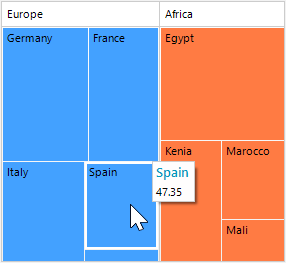
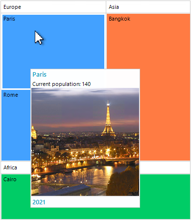
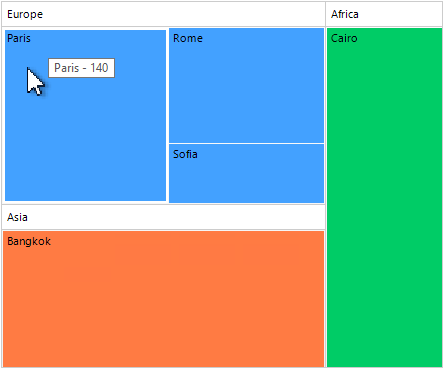
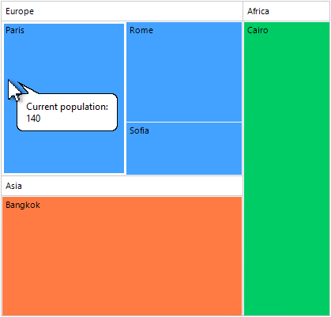

# Tooltips

RadTreeMap shows tooltips/screentips out of the box. The **ToolTipDisplayMode** property controls what type to be shown. The available options are:

* **None** - Does not display tool or screen tips.

* **ToolTip** - Displays a tool tip when an item or a group is hovered.

* **ScreenTip** - Displays a screen tip when an item or a group is hovered.

By default, ToolTipDisplayMode.**ScreenTip** is used:



## Events

### ScreenTipShowing

When the **ToolTipDisplayMode** property is set to **ScreenTip**, the **ScreenTipShowing** event is expected to be fired just before showing the screentip. This event can be canceled if the screentip shouldn't be shown in certain conditions. The **TreeMapScreenTipEventArgs** gives access to the following arguments:

* **Item** - Gets the data item or group. 

* **Delay** - Gets or sets the ScreenTip delay.

* **Location** - Gets or sets the ScreenTip location. 

* **FooterText** - Gets or sets the ScreenTip footer. 

* **Text** - Gets or sets the ScreenTip content. By default, it is the data item's value. 

* **CaptionText** - Gets or sets the ScreenTip caption. 

* **ScreenTip** - Gets the [RadOffice2007ScreenTipElement]().

#### Customizing Screentips

{{source=..\SamplesCS\TreeMap\TreeMapGettingStarted.cs region=Screentips}} 
{{source=..\SamplesVB\TreeMap\TreeMapGettingStarted.vb region=Screentips}} 

````C#

private void RadTreeMap1_ScreenTipShowing(object sender, TreeMapScreenTipEventArgs e)
{
    if (e.Item.Text == "Paris")
    {
        e.ScreenTip.MainTextLabel.Image = Properties.Resources.Paris;
        e.ScreenTip.MainTextLabel.TextImageRelation = TextImageRelation.TextAboveImage;
        e.Text = "Current population: " + e.Item.AlgorithmValue;
        e.FooterText = "2021";
    }
    else
    {
        e.FooterText = string.Empty;
        e.ScreenTip.MainTextLabel.Image = null;

    }
}     

````
````VB.NET

Private Sub RadTreeMap1_ScreenTipShowing(ByVal sender As Object, ByVal e As TreeMapScreenTipEventArgs)
    If e.Item.Text = "Paris" Then
        e.ScreenTip.MainTextLabel.Image = My.Resources.Paris
        e.ScreenTip.MainTextLabel.TextImageRelation = TextImageRelation.TextAboveImage
        e.Text = "Current population: " & e.Item.AlgorithmValue
        e.FooterText = "2021"
    Else
        e.FooterText = String.Empty
        e.ScreenTip.MainTextLabel.Image = Nothing
    End If
End Sub


````

{{endregion}} 



### ToolTipShowing

When the **ToolTipDisplayMode** property is set to **ToolTip**, the **ToolTipShowing** event is expected to be fired just before showing the RadToolTip. This event can be canceled if the tooltip shouldn't be shown in certain conditions. 



The **TreeMapToolTipEventArgs** gives access to the following argumens:

* **ToolTip** - Gets the [RadToolTip]().

* **Text** - Gets or sets the ToolTip text. 

* **Duration** - Gets or sets the ToolTip duration. 

* **Location** - Gets or sets the ToolTip location. 

* **Item** - Gets the data item or group. 
 
{{source=..\SamplesCS\TreeMap\TreeMapGettingStarted.cs region=Tooltips}} 
{{source=..\SamplesVB\TreeMap\TreeMapGettingStarted.vb region=Tooltips}} 

````C#

private void RadTreeMap1_ToolTipShowing(object sender, TreeMapToolTipEventArgs e)
{
    e.ToolTip.IsBalloon = true;
    e.Text = "Current population: " + e.Item.AlgorithmValue;
    e.Duration = 2000;
}
      
````
````VB.NET

Private Sub RadTreeMap1_ToolTipShowing(ByVal sender As Object, ByVal e As TreeMapToolTipEventArgs)
    e.ToolTip.IsBalloon = True
    e.Text = "Current population: " & e.Item.AlgorithmValue
    e.Duration = 2000
End Sub

````

{{endregion}} 



 
# See Also

* [Structure]() 

* [Layout Strategies]()

* [Colorizers]()

