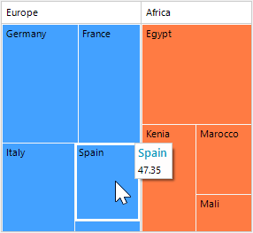
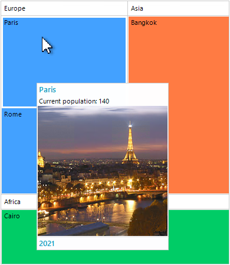
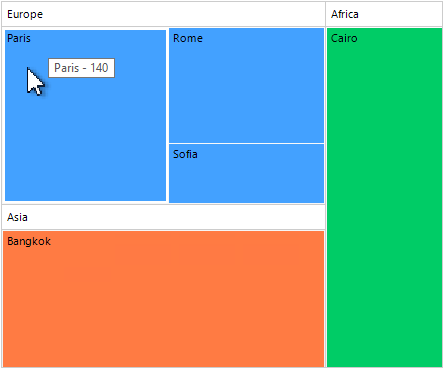
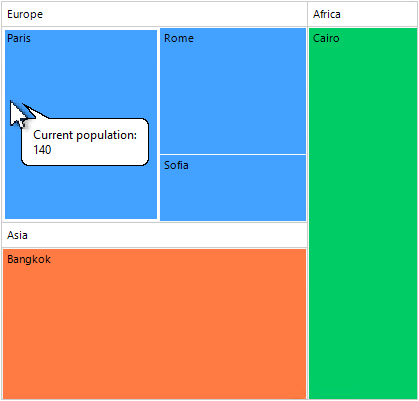

# Tooltips

RadTreeMap shows tooltips/screentips out of the box. The **ToolTipDisplayMode** property controls what type to be shown. The available options are:

* **None** - Does not display tool or screen tips.

* **ToolTip** - Displays a tool tip when an item or a group is hovered.

* **ScreenTip** - Displays a screen tip when an item or a group is hovered.

By default, ToolTipDisplayMode.**ScreenTip** is used:

## Events

### ScreenTipShowing

When the **ToolTipDisplayMode** property is set to **ScreenTip**, the **ScreenTipShowing** event is expected to be fired just before showing the screentip. This event can be canceled if the screentip shouldn't be shown in certain conditions. The **TreeMapScreenTipEventArgs** gives access to the following arguments:

* **Item** - Gets the data item or group. 

* **Delay** - Gets or sets the ScreenTip delay.

* **Location** - Gets or sets the ScreenTip location. 

* **FooterText** - Gets or sets the ScreenTip footer. 

* **Text** - Gets or sets the ScreenTip content. By default, it is the data item's value. 

* **CaptionText** - Gets or sets the ScreenTip caption. 

* **ScreenTip** - Gets the [RadOffice2007ScreenTipElement]().

#### Customizing Screentips

<snippet id='treemap-treemapgettingstarted-screentips-cs' />
<snippet id='treemap-treemapgettingstarted-screentips-vb' />

### ToolTipShowing

When the **ToolTipDisplayMode** property is set to **ToolTip**, the **ToolTipShowing** event is expected to be fired just before showing the RadToolTip. This event can be canceled if the tooltip shouldn't be shown in certain conditions. 

The **TreeMapToolTipEventArgs** gives access to the following argumens:

* **ToolTip** - Gets the [RadToolTip]().

* **Text** - Gets or sets the ToolTip text. 

* **Duration** - Gets or sets the ToolTip duration. 

* **Location** - Gets or sets the ToolTip location. 

* **Item** - Gets the data item or group. 
 
<snippet id='treemap-treemapgettingstarted-tooltips-cs' />
<snippet id='treemap-treemapgettingstarted-tooltips-vb' />

 
# See Also

* [Structure]() 

* [Layout Strategies]()

* [Colorizers]()

