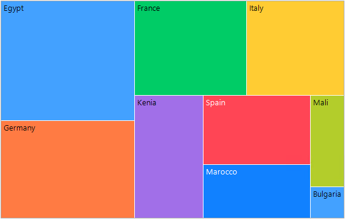

# Getting Started

This article shows how you can start using **RadTreeMap**. Just drag a RadTreeMap from the toolbox and drop it onto the form. Then, define the sample data in a DataTable and bind the control:

>important **RadTreeMap** is supported in .NET Framework 4.0 (or higher). 



{{source=..\SamplesCS\TreeMap\TreeMapGettingStarted.cs region=Populate}} 
{{source=..\SamplesVB\TreeMap\TreeMapGettingStarted.vb region=Populate}} 

````C#
            
DataTable dt = new DataTable();
dt.Columns.Add("Country", typeof(string));
dt.Columns.Add("Population", typeof(float));
dt.Columns.Add("Continent", typeof(string));

dt.Rows.Add("Italy", 59.55f, "Europe");
dt.Rows.Add("France", 67.39f, "Europe");
dt.Rows.Add("Germany", 83.24f, "Europe");
dt.Rows.Add("Spain", 47.35f, "Europe");
dt.Rows.Add("Bulgaria", 6.9f, "Europe");


dt.Rows.Add("Egypt", 102.3f, "Africa");
dt.Rows.Add("Marocco", 36.9f, "Africa");
dt.Rows.Add("Kenia", 53.77f, "Africa");
dt.Rows.Add("Mali", 20.25f, "Africa");

this.radTreeMap1.DisplayMember = "Country";
this.radTreeMap1.ValueMember = "Population";
this.radTreeMap1.DataSource = dt;

````
````VB.NET

Dim dt As DataTable = New DataTable()
dt.Columns.Add("Country", GetType(String))
dt.Columns.Add("Population", GetType(Single))
dt.Columns.Add("Continent", GetType(String))

dt.Rows.Add("Italy", 59.55F, "Europe")
dt.Rows.Add("France", 67.39F, "Europe")
dt.Rows.Add("Germany", 83.24F, "Europe")
dt.Rows.Add("Spain", 47.35F, "Europe")
dt.Rows.Add("Bulgaria", 6.9F, "Europe")

dt.Rows.Add("Egypt", 102.3F, "Africa")
dt.Rows.Add("Marocco", 36.9F, "Africa")
dt.Rows.Add("Kenia", 53.77F, "Africa")
dt.Rows.Add("Mali", 20.25F, "Africa")

Me.radTreeMap1.DisplayMember = "Country"
Me.radTreeMap1.ValueMember = "Population"
Me.radTreeMap1.DataSource = dt


````

{{endregion}} 

 
# See Also

* [Structure]() 

* [Layout Strategies]()

