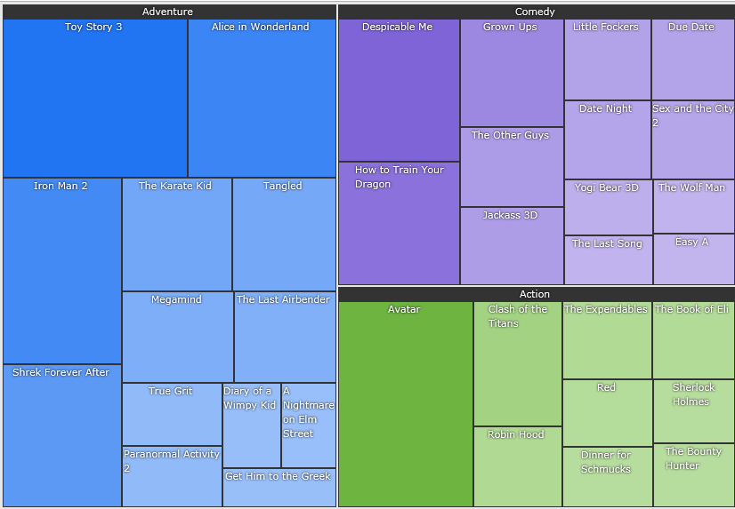
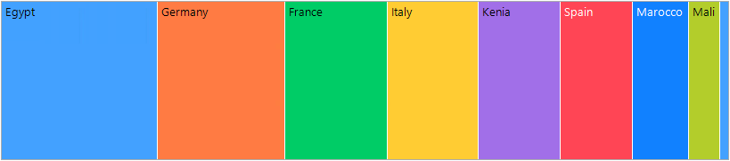
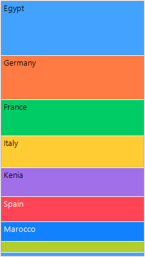

# Layout Strategies

By the end of this help topic, you will learn about the Layout Strategies which are responsible for data tiling in the RadTreeMap control. *Treemap* algorithms represent hierarchical data sets via recursive subdivision of the initial rectangle. The area of each rectangle in the treemap is proportional to the size of that particular node.

>note Layout Strategies are always applied to child nodes.

Currently there are two Layout Strategies to visualize the data:

### Squarified 

It creates rectangles with best aspect ratio:



{{source=..\SamplesCS\TreeMap\TreeMapGettingStarted.cs region=Squarified}} 
{{source=..\SamplesVB\TreeMap\TreeMapGettingStarted.vb region=Squarified}} 

````C#
            
SquarifiedAlgorithm squarifiedAlgorithm = new SquarifiedAlgorithm(); 
this.radTreeMap1.Algorithm = squarifiedAlgorithm;

````
````VB.NET
SquarifiedAlgorithm squarifiedAlgorithm = new SquarifiedAlgorithm(); 
this.radTreeMap1.Algorithm = squarifiedAlgorithm;

````

{{endregion}} 

>note The default layout is Squarified.

### Slice and Dice 

It creates rectangles with high aspect ratio and displays them sorted either horizontally or vertically:



For the **Slice and Dice** algorithm you can specify **Orientation** (*Horizontal*, *Vertical* or *Smart*) and **SortDirection** (*Ascending* or *Descending*):

{{source=..\SamplesCS\TreeMap\TreeMapGettingStarted.cs region=HorizontalSliceDice}} 
{{source=..\SamplesVB\TreeMap\TreeMapGettingStarted.vb region=HorizontalSliceDice}} 

````C#

SliceDiceAlgorithm sliceDiceAlgorithm = new SliceDiceAlgorithm();
sliceDiceAlgorithm.Orientation = SliceDiceOrientation.Horizontal;
sliceDiceAlgorithm.SortDirection = ListSortDirection.Descending;
this.radTreeMap1.Algorithm = sliceDiceAlgorithm;      

````
````VB.NET

Dim sliceDiceAlgorithm As SliceDiceAlgorithm = New SliceDiceAlgorithm()
sliceDiceAlgorithm.Orientation = SliceDiceOrientation.Horizontal
sliceDiceAlgorithm.SortDirection = System.ComponentModel.ListSortDirection.Descending
Me.radTreeMap1.Algorithm = sliceDiceAlgorithm

````

{{endregion}} 


Setting the **Orientation** to *Smart* means that the algorithm will automatically choose the most appropriate orientation depending on your data and the available space. 

{{source=..\SamplesCS\TreeMap\TreeMapGettingStarted.cs region=SmartSliceDice}} 
{{source=..\SamplesVB\TreeMap\TreeMapGettingStarted.vb region=SmartSliceDice}} 

````C#

SliceDiceAlgorithm sliceDiceAlgorithmSmart = new SliceDiceAlgorithm();
sliceDiceAlgorithmSmart.Orientation = SliceDiceOrientation.Smart;
this.radTreeMap1.Algorithm = sliceDiceAlgorithmSmart;          

````
````VB.NET

Dim sliceDiceAlgorithmSmart As SliceDiceAlgorithm = New SliceDiceAlgorithm()
sliceDiceAlgorithmSmart.Orientation = SliceDiceOrientation.Smart
Me.radTreeMap1.Algorithm = sliceDiceAlgorithmSmart

````

{{endregion}} 

#### Vertical Slice and Dice


 
# See Also

* [Structure]()

* [Getting Started]()

