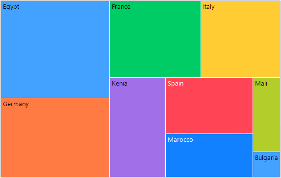
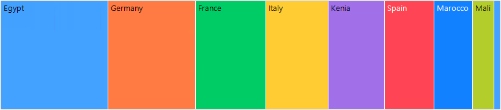
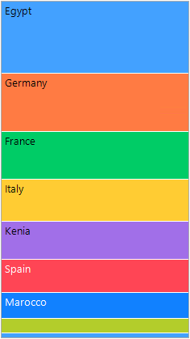

# Layout Strategies

By the end of this help topic, you will learn about the Layout Strategies which are responsible for data tiling in the RadTreeMap control. *Treemap* algorithms represent hierarchical data sets via recursive subdivision of the initial rectangle. The area of each rectangle in the treemap is proportional to the size of that particular node.

>note Layout Strategies are always applied to child nodes.

Currently there are two Layout Strategies to visualize the data:

### Squarified 

It creates rectangles with best aspect ratio:

<snippet id='treemap-treemapgettingstarted-squarified-cs' />
<snippet id='treemap-treemapgettingstarted-squarified-vb' />

>note The default layout is Squarified.

### Slice and Dice 

It creates rectangles with high aspect ratio and displays them sorted either horizontally or vertically:

For the **Slice and Dice** algorithm you can specify **Orientation** (*Horizontal*, *Vertical* or *Smart*) and **SortDirection** (*Ascending* or *Descending*):

<snippet id='treemap-treemapgettingstarted-horizontalslicedice-cs' />
<snippet id='treemap-treemapgettingstarted-horizontalslicedice-vb' />

Setting the **Orientation** to *Smart* means that the algorithm will automatically choose the most appropriate orientation depending on your data and the available space. 

<snippet id='treemap-treemapgettingstarted-smartslicedice-cs' />
<snippet id='treemap-treemapgettingstarted-smartslicedice-vb' />

#### Vertical Slice and Dice

 
# See Also

* [Structure]()

* [Getting Started]()

