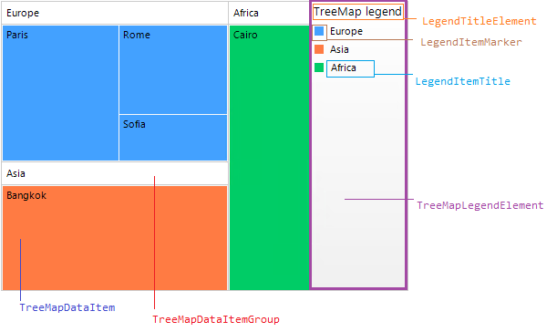

# Structure

This article describes the inner structure and organization of the elements which build **RadTreeMap**.

* **TreeMapDataItem** - represents the colored piece of RadTreeMap which size depends on the value it stores.

* **TreeMapDataItemGroup** - represents the group that holds the items.

* **TreeMapLegendElement** - represents the legend in RadTreeMap.

	* **LegendTitleElement** - represents the title of the legend.
	* **LegendItemElement** - represents the item's legend element.
		* **LegendItemTitle** - item's title.
		* **LegendItemMarker** - item's marker.

RadTreeMap doesn't use visual elements for its items. It directly paints the data items considering the values and the layout [algorithm]().

## Elements Hierarchy

 
# See Also

* [Data Binding]()

* [Getting Started]()

* [Layout Strategies]()

