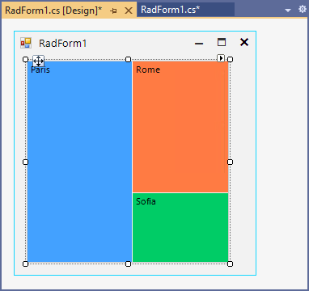
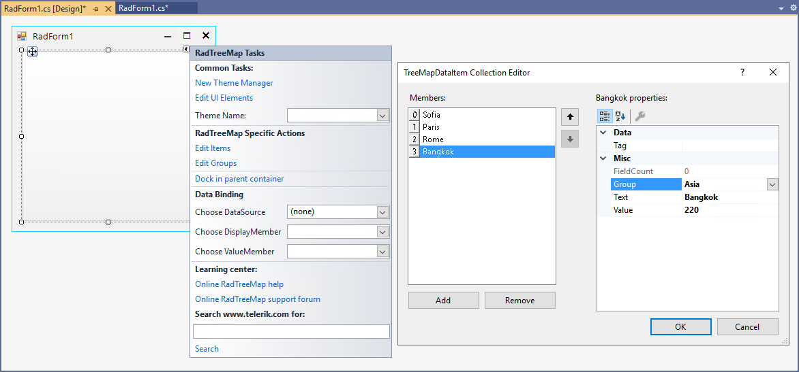
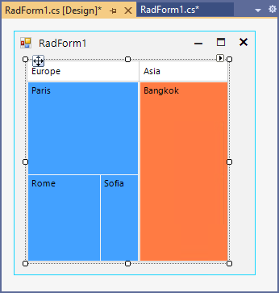
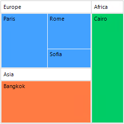

# Unbound Mode

**RadTreeMap** allows adding items/groups either at design time or at run time.

### Populating with Data at Design Time

Select RadTreeMap and click the small arrow on the top right position in order to open the Smart Tag.


In the **RadTreeMap Specific Actions** section, there are options for adding items/groups:

* Edit Items - opens the *TreeMapDataItem Collection Editor* which allows adding tree map items at design time. Specify the **Text** and **Value** for each item. 



	
* Edit Groups - opens the *TreeMapDataItemGroup Collection Editor* allows adding tree map groups at design time. 


Then, you can click the *Edit Items* option and specify the **Group** for each added item:





### Populating with Data at Run Time
 
{{source=..\SamplesCS\TreeMap\TreeMapGettingStarted.cs region=UnboundMode}} 
{{source=..\SamplesVB\TreeMap\TreeMapGettingStarted.vb region=UnboundMode}} 

````C#

TreeMapDataItemGroup treeMapDataItemGroup1 = new TreeMapDataItemGroup();
TreeMapDataItemGroup treeMapDataItemGroup2 = new TreeMapDataItemGroup();
TreeMapDataItemGroup treeMapDataItemGroup3 = new TreeMapDataItemGroup();
TreeMapDataItem treeMapDataItem1 = new TreeMapDataItem();
TreeMapDataItem treeMapDataItem2 = new TreeMapDataItem();
TreeMapDataItem treeMapDataItem3 = new TreeMapDataItem();
TreeMapDataItem treeMapDataItem4 = new TreeMapDataItem();
TreeMapDataItem treeMapDataItem5 = new TreeMapDataItem();

treeMapDataItemGroup1.LegendTitle = "Europe";
treeMapDataItemGroup1.Text = "Europe";
treeMapDataItemGroup2.LegendTitle = "Asia";
treeMapDataItemGroup2.Text = "Asia";
treeMapDataItemGroup3.LegendTitle = "Africa";
treeMapDataItemGroup3.Text = "Africa";
this.radTreeMap1.Groups.AddRange(new Telerik.WinControls.UI.TreeMap.TreeMapDataItemGroup[] {
treeMapDataItemGroup1,
treeMapDataItemGroup2,
treeMapDataItemGroup3});
treeMapDataItem1.Group = treeMapDataItemGroup1;
treeMapDataItem1.Text = "Sofia";
treeMapDataItem1.Value = 45;
treeMapDataItem2.Group = treeMapDataItemGroup1;
treeMapDataItem2.Text = "Paris";
treeMapDataItem2.Value = 140;
treeMapDataItem3.Group = treeMapDataItemGroup1;
treeMapDataItem3.Text = "Rome";
treeMapDataItem3.Value = 86;
treeMapDataItem4.Group = treeMapDataItemGroup2;
treeMapDataItem4.Text = "Bangkok";
treeMapDataItem4.Value = 220;
treeMapDataItem5.Group = treeMapDataItemGroup3;
treeMapDataItem5.Text = "Cairo";
treeMapDataItem5.Value = 180;
this.radTreeMap1.Items.AddRange(new Telerik.WinControls.UI.TreeMap.TreeMapDataItem[] {
treeMapDataItem1,
treeMapDataItem2,
treeMapDataItem3,
treeMapDataItem4,
treeMapDataItem5});    

````
````VB.NET

Dim treeMapDataItemGroup1 As TreeMapDataItemGroup = New TreeMapDataItemGroup()
Dim treeMapDataItemGroup2 As TreeMapDataItemGroup = New TreeMapDataItemGroup()
Dim treeMapDataItemGroup3 As TreeMapDataItemGroup = New TreeMapDataItemGroup()
Dim treeMapDataItem1 As TreeMapDataItem = New TreeMapDataItem()
Dim treeMapDataItem2 As TreeMapDataItem = New TreeMapDataItem()
Dim treeMapDataItem3 As TreeMapDataItem = New TreeMapDataItem()
Dim treeMapDataItem4 As TreeMapDataItem = New TreeMapDataItem()
Dim treeMapDataItem5 As TreeMapDataItem = New TreeMapDataItem()
treeMapDataItemGroup1.LegendTitle = "Europe"
treeMapDataItemGroup1.Text = "Europe"
treeMapDataItemGroup2.LegendTitle = "Asia"
treeMapDataItemGroup2.Text = "Asia"
treeMapDataItemGroup3.LegendTitle = "Africa"
treeMapDataItemGroup3.Text = "Africa"
Me.radTreeMap1.Groups.AddRange(New Telerik.WinControls.UI.TreeMap.TreeMapDataItemGroup() {treeMapDataItemGroup1,
                               treeMapDataItemGroup2, treeMapDataItemGroup3})
treeMapDataItem1.Group = treeMapDataItemGroup1
treeMapDataItem1.Text = "Sofia"
treeMapDataItem1.Value = 45
treeMapDataItem2.Group = treeMapDataItemGroup1
treeMapDataItem2.Text = "Paris"
treeMapDataItem2.Value = 140
treeMapDataItem3.Group = treeMapDataItemGroup1
treeMapDataItem3.Text = "Rome"
treeMapDataItem3.Value = 86
treeMapDataItem4.Group = treeMapDataItemGroup2
treeMapDataItem4.Text = "Bangkok"
treeMapDataItem4.Value = 220
treeMapDataItem5.Group = treeMapDataItemGroup3
treeMapDataItem5.Text = "Cairo"
treeMapDataItem5.Value = 180
Me.radTreeMap1.Items.AddRange(New Telerik.WinControls.UI.TreeMap.TreeMapDataItem() {treeMapDataItem1,
                              treeMapDataItem2, treeMapDataItem3, treeMapDataItem4, treeMapDataItem5})

````

{{endregion}}


 
# See Also

* [Structure]() 

* [Layout Strategies]()

* [Getting Started]()


