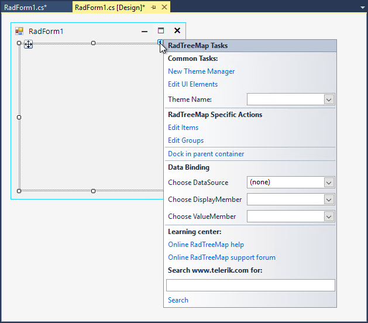
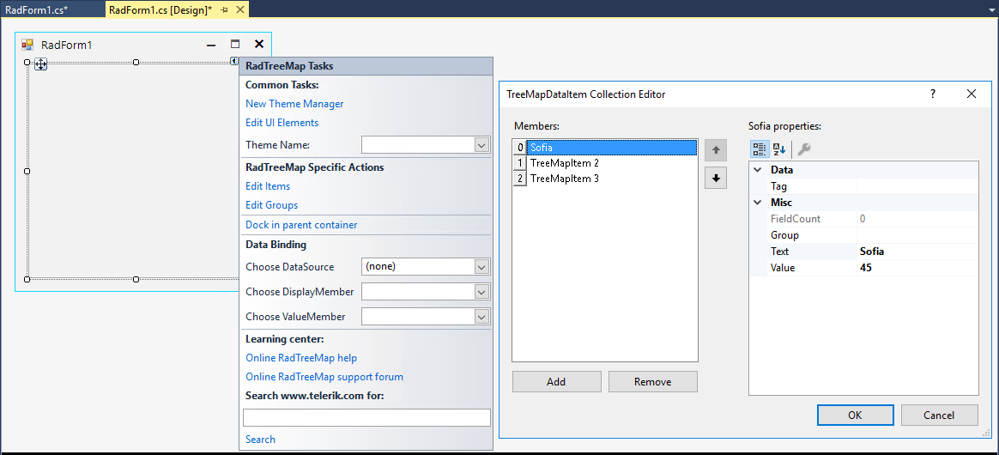
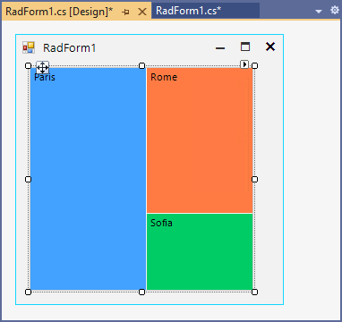
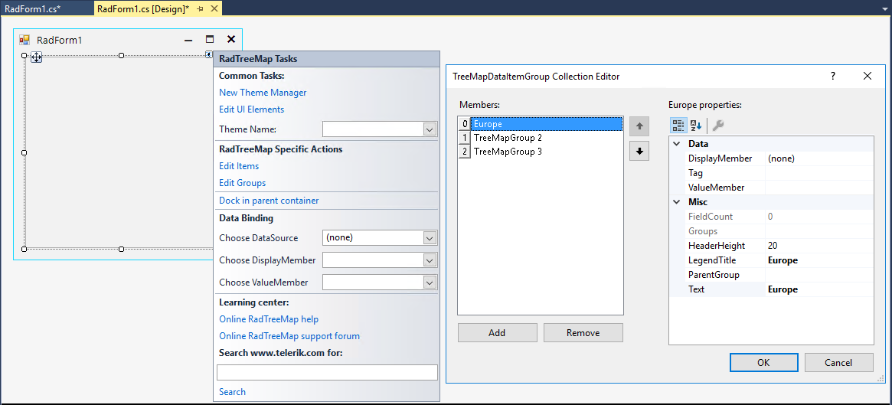
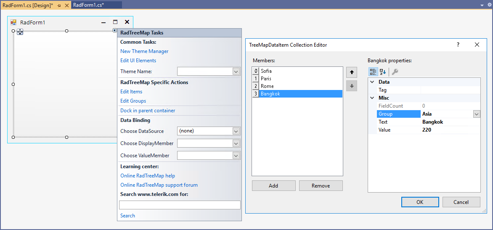
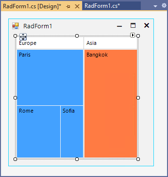
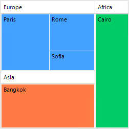

# Unbound Mode

**RadTreeMap** allows adding items/groups either at design time or at run time.

### Populating with Data at Design Time

Select RadTreeMap and click the small arrow on the top right position in order to open the Smart Tag.

In the **RadTreeMap Specific Actions** section, there are options for adding items/groups:

* Edit Items - opens the *TreeMapDataItem Collection Editor* which allows adding tree map items at design time. Specify the **Text** and **Value** for each item. 

	
* Edit Groups - opens the *TreeMapDataItemGroup Collection Editor* allows adding tree map groups at design time. 

Then, you can click the *Edit Items* option and specify the **Group** for each added item:

### Populating with Data at Run Time
 
<snippet id='treemap-treemapgettingstarted-unboundmode-cs' />
<snippet id='treemap-treemapgettingstarted-unboundmode-vb' />

 
# See Also

* [Structure]() 

* [Layout Strategies]()

* [Getting Started]()

* [Data Binding]()

