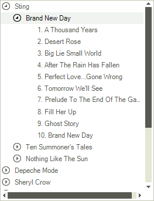
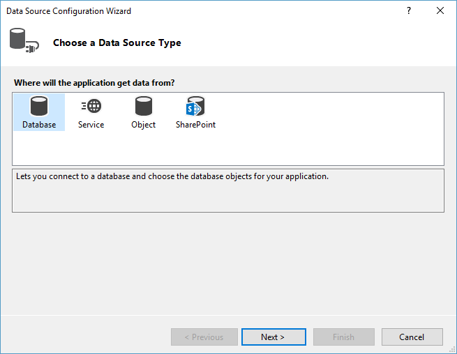
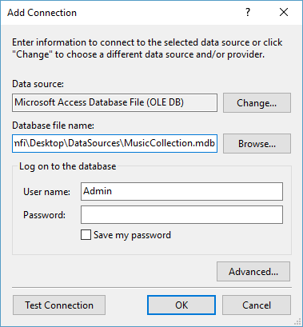

# Binding to Database Data

RadTreeView supports binding to Database data. Levels are created using the RadTreeView __RelationBindings__ collection. Each __RelationBinding__ object describes the parent data being bound to, the child data being bound to and the data columns used to populate __Text__ and __Value__ properties of the nodes. The __RelationBinding__ constructor has several overrides. Minimally RelationName and DataSource must be passed to the __Add()__ method. The example shown below includes the following parameters:
      

* __DataSource__: The data source object being bound to. In this example the data source is the generic list of `Category` objects.
          

* __DataMember__: This is a name of a specific record set within the __DataSource__. Only one set of records exists in this example so the passed parameter is null.
          

* __DisplayMember__: The name of the field that populates the __Text__ property of each node. 
          

* __ValueMember__: The name of the data field that populates the __Value__ property of each node.
          

* __ParentMember__: The name of the parent data field which takes part in the relation.
          

* __ChildMember__: The name of the child data field which takes part in the relation.
          



The purpose of this example is to demonstrate how to bind to database data.

1. In a new Windows project drop a __RadTreeView__ control on the form.

1. In the __DataSource__ property drop down in the Properties Window select the __Add Project Data Source__ link.

1. In the __Choose a Data Source Type__ page select the __Database__ icon, then click __Next__.

    

1. In the __Choose Your Data Connection__ page of the wizard click __New Connection__.

1. In the __Add Connection__ dialog click the __Change__ button, select "Microsoft Access Database File" and click the __OK__ button. In the __Database file name__ entry click the __Browse__ button and locate the `MusicCollection.mdb` file in the installation directory under `\Examples\DataSources`. Click __OK__. When prompted if you would like to copy the local data file to your project click __Yes__.

    

1. In the __Choose Your Database Objects__ page of the wizard select the "Artists", "Albums" and "Songs" tables checkboxes. Click __Finish__.

    

1. Set the __DataSource__ property first to `Songs`, then to `Albums` and finally to `Artists` data table. This will create the necessary data-binding components in the component tray - a DataSet, BindingSources and TableAdapters. The DataSet is the container for the data, the TableAdapters are used to fill the DataSet.

1. In the form's __Load__ event handler add the code shown below.

{{source=..\SamplesCS\TreeView\DataBinding\BindingToDatabaseData.cs region=database}} 
{{source=..\SamplesVB\TreeView\DataBinding\BindingToDatabaseData.vb region=database}} 

````C#
this.radTreeView1.DataSource = this.artistsBindingSource;
this.radTreeView1.DisplayMember = "ArtistName";
this.radTreeView1.ValueMember = "ArtistID";
this.radTreeView1.RelationBindings.Add(new RelationBinding(this.albumsBindingSource, "AlbumName", "ArtistID", "ArtistID", "AlbumID"));
this.radTreeView1.RelationBindings.Add(new RelationBinding(this.songsBindingSource, "SongName", "AlbumID", "AlbumID", "SongID"));

````
````VB.NET
Me.RadTreeView1.DataSource = Me.ArtistsBindingSource
Me.RadTreeView1.DisplayMember = "ArtistName"
Me.RadTreeView1.ValueMember = "ArtistID"
Me.RadTreeView1.RelationBindings.Add(New RelationBinding(Me.AlbumsBindingSource, "AlbumName", "ArtistID", "ArtistID", "AlbumID"))
Me.RadTreeView1.RelationBindings.Add(New RelationBinding(Me.SongsBindingSource, "SongName", "AlbumID", "AlbumID", "SongID"))

````

{{endregion}}


# See Also
* [Binding to Object-relational Data]()

* [Binding to Self Referencing Data]()

* [Binding to XML Data]()

* [Data Binding]()

* [Binding CheckBoxes]()

* [Serialize/Deserialize to XML]()

