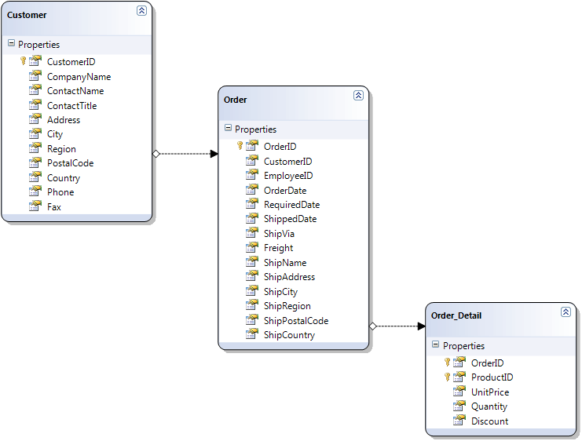
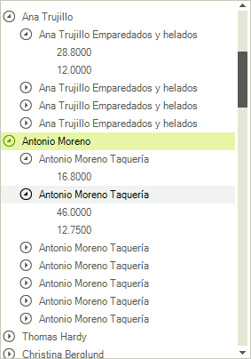

# Binding to Object-relational Data

RadTreeView has the ability to bind to related data of custom objects which have member collections of related objects (ORM generated classes for example).

Consider the following class diagram: 



There are three classes named __Customer__, __Order__ and __Order_Detail__. The data relations in the case of custom objects are represented by properties which provide references to collections of related objects. In this case the __Customer__ class has a property named __Orders__ which is a collection of __Order__ objects. This is the first relation. The second relation is the __Order_Details__ property in the __Order__ class, it offers a reference to a collection of __Order_Details__. Once you have such class composition, it is trivial for RadTreeView to represent it visually in your application.
        

The two steps that must be done are these:

1\. Set the DataSource of RadTreeView to a collection of your root objects (a collection of Customer object in this case):

{{source=..\SamplesCS\TreeView\DataBinding\BindingToRelatedData.cs region=customers}} 
{{source=..\SamplesVB\TreeView\DataBinding\BindingToRelatedData.vb region=customers}} 

````C#
            
IEnumerable<Customer> customers = context.GetTable<Customer>().ToList();       
this.radTreeView1.DataSource = customers;

````
````VB.NET
Dim customers As IEnumerable(Of Customer) = context.GetTable(Of Customer)().ToList()
Me.RadTreeView1.DataSource = customers

````

{{endregion}} 

>note The above context object is created by binding the project to the NorthWind database using [LINQ to SQl](https://msdn.microsoft.com/en-us/library/bb386976(v=vs.110).aspx)

2\. Set the __DisplayMember__ corresponding to the DisplayMembers of the different types of objects and set the __ChildMember__ corresponding to the names of the properties that represent the collections of sub objects.

{{source=..\SamplesCS\TreeView\DataBinding\BindingToRelatedData.cs region=relationClasses}} 
{{source=..\SamplesVB\TreeView\DataBinding\BindingToRelatedData.vb region=relationClasses}} 

````C#
            
this.radTreeView1.DisplayMember = "ContactName\\ShipName\\UnitPrice";
this.radTreeView1.ChildMember = "Customers\\Orders\\Order_Details";

````
````VB.NET
Me.RadTreeView1.DisplayMember = "ContactName\ShipName\UnitPrice"
Me.RadTreeView1.ChildMember = "Customers\Orders\Order_Details"

````

{{endregion}} 

As a result, we get the following hierarchy in RadTreeView:




# See Also
* [Binding to Database Data]()

* [Binding to Self Referencing Data]()

* [Binding to XML Data]()

* [Data Binding]()

* [Binding CheckBoxes]()

* [Serialize/Deserialize to XML]()

