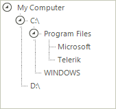

# Binding to Self Referencing Data

Binding RadTreeView to self referencing data differs from [binding to related data]() in that RadTreeView is bound to a single list instead of multiple related lists.
 
In order to set the parent-child relation between the records of the data source, we should set the __ParentMember__ and __ChildMember__ properties to the respective fields in the data source. If the parent `ID` for a record does not have a respective value in the child `ID` field of the records, then that record is considered to have no parents.
		
>important All parent identifiers must be positive numbers.

## Minimal example

The following example demonstrates how to bind RadTreeView to a self referencing DataTable.

<snippet id='treeview-bindingtoselfrefdata-selfref-cs' />
<snippet id='treeview-bindingtoselfrefdata-selfref-vb' />

As a result we get the hierarchy of nodes shown below:

# See Also
* [Binding to Database Data]()

* [Binding to Object-relational Data]()

* [Binding to XML Data]()

* [Data Binding]()

* [Binding CheckBoxes]()

* [Serialize/Deserialize to XML]()

