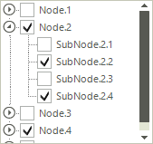
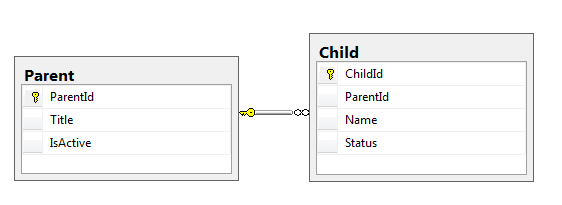
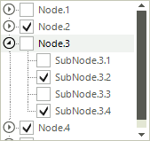

# Binding check boxes

Since R3 2014 __RadTreeView__ supports binding the check-boxes of the nodes to a field in the data. You just need to specify   the RadTreeView. __CheckedMember__ property. The following code snippet demonstrates how to setup hierarchical tree by using two separate DataTables:

<snippet id='treeview-basicshierarchyform-checkedmember-cs' />
<snippet id='treeview-basicshierarchyform-checkedmember-vb' />

## Binding CheckBoxes with Object Relational Hierarchy

Consider the following diagram which can be illustrated with the sample classes below: 

Note that the __IsActive__ and the __Status__ properties represent boolean data. 

<snippet id='treeview-bindingtorelateddata-dataclasses-cs' />
<snippet id='treeview-bindingtorelateddata-dataclasses-vb' />

The code snippet below illustrates how to bind the check-boxes coming from the described properties:

<snippet id='treeview-bindingtorelateddata-checkedmember-cs' />
<snippet id='treeview-bindingtorelateddata-checkedmember-vb' />

# See Also
* [Binding to Database Data]()

* [Binding to Object-relational Data]()

* [Binding to Self Referencing Data]()

* [Binding to XML Data]()

* [Data Binding]()

* [Serialize/Deserialize to XML]()

