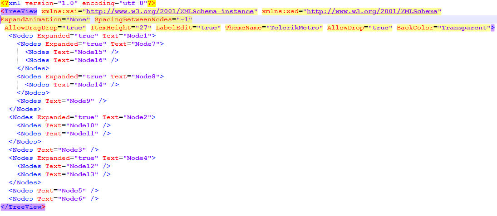

# Serialize/Deserialize to XML

RadTreeView methods __LoadXML__ and __SaveXML__ serialize the contents and state of the entire RadTreeView and its nodes. These methods can be useful when you want to save the data locally and without needing to connect to a database for binding.

````xml
TreeView xmlns:xsi="http://www.w3.org/2001/XMLSchema-instance" xmlns:xsd="http://www.w3.org/2001/XMLSchema" AllowDragDrop="true" LabelEdit="true" ThemeName="Breeze" AllowDrop="true" BackColor="Transparent"><Nodes Expanded="true" Text="Node1"><Nodes Expanded="true" Text="Node7"><Nodes Text="Node15" /><Nodes Text="Node16" /></Nodes><Nodes Expanded="true" Text="Node8"><Nodes Text="Node14" /></Nodes><Nodes Text="Node9" /></Nodes><Nodes Expanded="true" Text="Node2"><Nodes Text="Node10" /><Nodes Text="Node11" /></Nodes><Nodes Text="Node3" /><Nodes Expanded="true" Text="Node4"><Nodes Text="Node12" /><Nodes Text="Node13" /></Nodes><Nodes Text="Node5" /><Nodes Text="Node6" /></TreeView>

````

>note For direct access to the tree view XML as text use the __TreeViewXML__ property.

>important As of R2 2021 we are using the XmlReader class to read the XML content before loading it in the control. If you are using the LoadXml method and pass a file path to load the layout from a file, make sure that the document is properly encoded. If you are using the overload with the memory stream, make sure that you are writing the stream with the correct encoding. In case you are not sure what encoding to use, you can specify Encoding.Unicode.

>important As of R2 2022 SP1 a new static property is introduced. It determines whether to use InvariantCulture when serializing and deserializing the tree nodes: XmlTreeNode.**UseInvariantCulture** = true. By default, the property is set to true. 

The contents of the saved XML file contain the properties for the RadTreeView as a whole and each of the nodes in the tree.



>note  __RadTreeView__ supports save/load functionality at design time via the [Property Builder]().
>


# See Also
* [Binding to Database Data]()

* [Binding to Object-relational Data]()

* [Binding to Self Referencing Data]()

* [Binding to XML Data]()

* [Data Binding]()

* [Binding CheckBoxes]()

