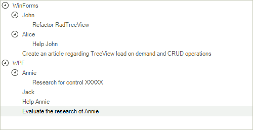
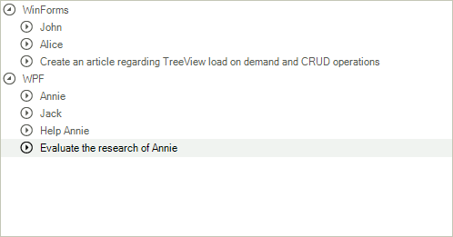

# Load On Demand with CRUD operations

If you have a complex hierarchy, which includes business objects of different types, some of them have children and some do not, and you need to visualize it using RadTreeView while keeping the __CRUD__ operations, then this article is for you.

In this example, we will use the following scenario: A hierarchy, which has __Teams__, each __Team__ has __TeamMembers__ and __Tasks__, and each __TeamMember__ has his own __Tasks__. Every __Team__, __TeamMember__ and __Task__ have names which will be displayed in the __RadTreeView__.

Below you can see the implementation of these types. Note that their child collections are __BindingLists__ and that every type implements __INotifyPropertyChanged__. We will use this approach so that every property change will bubble up to the top-most collection which we will monitor:

<snippet id='treeview-loadondemandwithcrudoperations-models-cs' />
<snippet id='treeview-loadondemandwithcrudoperations-models-vb' />

Now, we need to initialize the __RadTreeView__, which will visualize our business objects:

<snippet id='treeview-loadondemandwithcrudoperations-initilaizetreeview-cs' />
<snippet id='treeview-loadondemandwithcrudoperations-initilaizetreeview-vb' />

Since we will not bind our objects to __RadTreeView__, we will use the __Tag__ property to save the business object. The following method will be very helpful further in this article:

<snippet id='treeview-loadondemandwithcrudoperations-createnode-cs' />
<snippet id='treeview-loadondemandwithcrudoperations-createnode-vb' />

After we have this method and our tree view set up, we can actually create the hierarchy:

<snippet id='treeview-loadondemandwithcrudoperations-initializehierarchy-cs' />
<snippet id='treeview-loadondemandwithcrudoperations-initializehierarchy-vb' />

You see at the bottom that we are adding the __Teams__ to the __Nodes__ collection of the __RadTreeView__. They will be our base and when expanded we will load their children.

As we speak about loading children, you need to subscribe to the __NodesNeeded__ event.  In the event handler we will check for the __Tag__ of the parent node and of the current node. This will allow us to get the appropriate type and load its children. For example, If the parent is a __Team__ then we need to load this __Team’s TeamMembers__ and __Tasks__:

<snippet id='treeview-loadondemandwithcrudoperations-nodesneeded-cs' />
<snippet id='treeview-loadondemandwithcrudoperations-nodesneeded-vb' />

 

If you run the application now, you will notice that the nodes are loading their children, however there is something which we do not really like. We know that the __Tasks__ do not have any children, yet, they have expanders in front of them. We can easily correct that by using the __NodeFormatting__ event. In the event handler we simply check if the node’s __Tag__ is a __Task__ and if it is __TeamMember__, whether it has any __Tasks__, and if it is a __Team__, whether it has any __TeamMembers__ or __Tasks__ and hide the expander appropriately.

<snippet id='treeview-loadondemandwithcrudoperations-nodeformatting-cs' />
<snippet id='treeview-loadondemandwithcrudoperations-nodeformatting-vb' />

Now, our hierarchy is properly visualized, all we have left to do is to implement the CRUD operations which will keep the __RadTreeView__ and the __BindingList__ synchronized. To handle the case where a node is removed/added from/to __RadTreeView__ you will need to subscribe to the __NodeRemoving__ and __NodeAdded__ event handlers, respectively. What will happen in these event handlers is very similar to what is happening in the __NodesNeeded__ event handler from before, where we check the parent and modify its children:

<snippet id='treeview-loadondemandwithcrudoperations-nodeaddedandnoderemoving-cs' />
<snippet id='treeview-loadondemandwithcrudoperations-nodeaddedandnoderemoving-vb' />

And to handle the case where something is modified in the data source, we will need to subscribe to the __ListChanged__ event of the __BindingList__ and rebuild the __RadTreeView__ by clearing the nodes and re-adding the first level nodes.  You can optionally save the expanded node’s state as per [this article](http://www.telerik.com/help/winforms/treeview-how-to-keep-radtreeview-states-on-reset.html). 
        

# See Also
* [Binding to Database Data]()

* [Binding to Object-relational Data]()

* [Binding to Self Referencing Data]()

* [Binding to XML Data]()

* [Data Binding]()

* [Binding CheckBoxes]()

