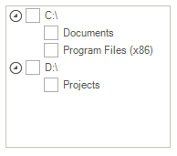

<table>
	<tr>
		<td>Product Version</td>
		<td>2018.3 911</td>
	</tr>
	<tr>
		<td>Product</td>
		<td>RadTreeView for WinForms</td>
	</tr>
</table>

# ToggleStateConverter

**RadTreeView** allows binding the check boxes to a custom property from the associated data object by specifying the RadTreeView.**CheckedMember** property. A common case is when the specified [CheckedMember]() is a property of custom type and it should be converted to **ToggleState** which is required by the check boxes in the tree view. This article demonstrates how you can modify the way a property is being displayed and edited by using custom TypeConverters. 
A [Type Converter]( https://msdn.microsoft.com/en-us/library/ayybcxe5.aspx) is used to convert values between data types. Here are the four main methods that are usually used when implementing a custom __Type Converter__.

* Override the __CanConvertFrom__ method that specifies which type the converter can convert from.

* Override the __ConvertFrom__ method that implements the conversion.

* Override the __CanConvertTo__ method that specifies which type the converter can convert to. 

* Override the __ConvertTo__ method that implements the conversion. 

Consider the **RadTreeView** is populated with **Item** objects having the following properties:

#### Item class

<snippet id='treeview-treeviewtogglestateconverter-itemobject-cs' />
<snippet id='treeview-treeviewtogglestateconverter-itemobject-vb' />

The tree view is populated with data as follows:

#### Bind RadTreeView 

<snippet id='treeview-treeviewtogglestateconverter-populatetreeview-cs' />
<snippet id='treeview-treeviewtogglestateconverter-populatetreeview-vb' />

The specified **CheckedMember** is the Item.**IsActive** property which is typeof(string) indicating the *"true"* / *"false"* values. In order to convert these string values to a valid **ToggleState** you need to use a custom [Type Converter]( https://msdn.microsoft.com/en-us/library/ayybcxe5.aspx). The following code snippet illustrates a sample implementation:

#### Custom TypeConverter's implementation

<snippet id='treeview-treeviewtogglestateconverter-treeviewtoggleconverter-cs' />
<snippet id='treeview-treeviewtogglestateconverter-treeviewtoggleconverter-vb' />

Now, you need to apply the custom **TypeConverter** to the RadTreeView.**ToggleStateConverter** property:

>important The property was introduced in **R3 2018 (version 2018.3.911)**.

#### Set the ToggleStateConverter

<snippet id='treeview-treeviewtogglestateconverter-setcustomtoggleconverter-cs' />
<snippet id='treeview-treeviewtogglestateconverter-setcustomtoggleconverter-vb' />

Now, you can toggle/untoggle the nodes and this will be properly reflected to the underlying data object:

Note that following this approach it is possible to convert any custom type to **ToggleState** and thus bind the check boxes in the tree view to any custom property that you have. It is just necessary to implement the specific conversion.

 
# See Also

* [Binding CheckBoxes]()

