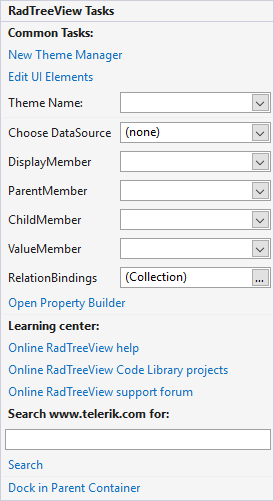

# Smart Tag

The Smart Tag for RadTreeView lets you quickly access common tasks involved with building RadTreeView elements and customizing appearance through themes.

* __Common Tasks__
    
    - __New Theme Manager__: Adds a new __RadThemeManager__ component to the form.

    - __Edit UI elements__: Opens a dialog that displays the __Element Hierarchy Editor__. This editor lets you browse all the elements in the control, including the RadGridView itself and elements that make up the columns, rows, headers and other parts of the grid. 

    - __Theme Name__: Select a theme name from the drop down list of themes available for that control. Selecting a theme allows you to change all aspects of the controls visual style at one time. 

* __Data Binding__

    - __Choose DataSource:__ Allows you to select a DataSource in order to populate the control.

    - __DisplayMemeber:__ Sets the display member.

    - __ParentMember:__ Sets the parent member.

    - __ChildMember:__ Sets the child member.
    
    - __ValueMember:__ Sets the value member.
    
    - __Relation Bindings:__ Allow you to edit the relations collection.

* __[OpenProperty Builder]()__: Use the Property Builder to quickly create and arrange node structure and appearance.

* __Learning Center__: Navigate to the Telerik help, code library projects or support forum.

* __Search__: Search the Telerik site for a given string.

* __Dock in parent container__: Docks RadTreeView into the parent container.

# See Also
* [Property Builder]()

