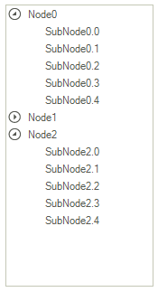
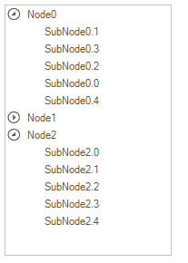

# Drag and Drop in bound mode

When __RadTreeView__ is in bound mode, it supports a basic drag and drop behavior. The dragged node is inserted at the last position in its parent.

>caption Figure 1: Default drag and drop behavior in bound mode

In order to enable this functionality, you should set the __AllowDragDrop__ property to *true*. However, due to the specificity of  the __RadTreeView__’s [data binding]()  and the set up hierarchical data structure, it is necessary to handle manually the drag and drop operation to obtain correct nodes order. 

>caption Figure 2: Custom drag and drop behavior in bound mode

For this purpose, it is necessary to create a custom __TreeViewDragDropService__. This article demonstrates a sample approach how to achieve it.

1\. Consider the __RadTreeView__ is bound to the following [self-referencing data]().

<snippet id='treeview-draganddropinboundmode-selfrefdata-cs' />
<snippet id='treeview-draganddropinboundmode-selfrefdata-vb' />

2\. Enable multiple [selection]() by setting the __MultiSelect__  property to *true*.

3\. Create a derivative of the __TreeViewDragDropService__ which should perform the desired drag and drop functionality.  The __OnPreviewDragOver__ method allows you to control on what targets the nodes, being dragged, can be dropped on. The __OnPreviewDragDrop__ method initiates the actual physical move of the nodes from one position to another.

<snippet id='treeview-draganddropinboundmode-customservice-cs' />
<snippet id='treeview-draganddropinboundmode-customservice-vb' />

>note When a change in the underlying data source occurs, the tree needs to repopulate itself in order to get the latest changes. As a result, the expanded state of the available nodes, selection and scroll bar position are not kept. [Keep RadTreeView states on reset]() help article explains how to save the tree state prior the change and restore it afterwards.
>

4\. The custom __TreeViewDragDropService__ is ready. Now, we need to replace the default one. For this purpose, it is necessary to create a derivative of the __RadTreeViewElement__ and override the __CreateDragDropService__ method. 

<snippet id='treeview-draganddropinboundmode-customtreeviewelement-cs' />
<snippet id='treeview-draganddropinboundmode-customtreeviewelement-vb' />

5\. Finally, replace the default __RadTreeViewElement__ in the tree with the custom one.

<snippet id='treeview-draganddropinboundmode-treeview-cs' />
<snippet id='treeview-draganddropinboundmode-treeview-vb' />

# See Also
* [Cancel a Drag and Drop Operation]()

* [Enabling Drag and Drop]()

* [Modify the DragDropService behavior]()

