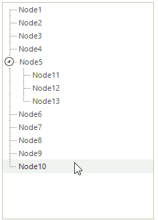
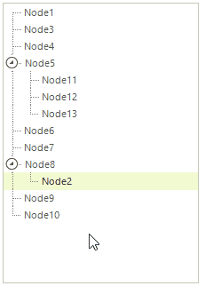

# Enabling Drag and Drop

The key RadTreeView boolean properties enable Drag and Drop functionality: __AllowDragDrop__, and __AllowDrop__.

* __AllowDragDrop__ enables the drag and drop functionality for a tree view control. Drag and drop functionality can also be used to reorder nodes.

* __AllowDrop__ when true accepts data that the user drags onto it. This property is used to interact with drag and drop for standard Windows controls.

>note Multiple nodes can be dragged if the RadTreeView's __MultiSelect__ property is true.
>

## AllowDragDrop

__AllowDragDrop__ when true enables fully automatic drag and drop. The selected node and child nodes are all moved to the target location with user interaction only. No code is required. The following screenshots show drag and drop behaviors. Notice the visual cues that assist the user in navigating the tree.


| __Description__ | __User Action__ |
|-----|-----|
|"Node"2" is dropped on "Node8". The result is that "Node2" is added as a child node of "Node8".||
|For the other cases the dashed line described there the dragged node will be inserted. In this case "Node9" is going to me placed between nodes "Node11" and "Node12". The result is that "Node9" will be added as a sibling of "Node11" and located just above "Node12".||

## AllowDrop 

__AllowDrop__ when true enables RadTreeView to accept data dropped onto it. This event can be used to allow interaction between standard Windows controls  and RadTreeView. In the example below a RadTextBox control is dragged to a RadTreeNode.


>note In order to use the standard OLE drag drop you need to disable the built-in drag and drop functionality (set AllowDragDrop to false).

To implement this functionality:

* Set __AllowDrop__ for both RadTreeView and the RadTextBox control to *true*.
            

* Implement the __MouseDown__ event handler of the RadTextBox HostedControl to call the control's __DoDragDrop()__ method.
          
* Implement the RadTreeView DragEnter event handler to set the arguments __Effects__ property.

* Implement the RadTreeView DragDrop event handler to react to the drop operation. In the code sample below the RadTreeView __PointToClient()__ and __GetNodeAt()__ methods are used to retrieve the dropped node.


{{source=..\SamplesCS\TreeView\DragAndDrop\EnablingDragAndDrop.cs region=dragDrop}} 
{{source=..\SamplesVB\TreeView\DragAndDrop\EnablingDragAndDrop.vb region=dragDrop}} 

````C#
public EnablingDragAndDrop()
{
    InitializeComponent();
    radTextBox1.TextBoxElement.TextBoxItem.HostedControl.MouseDown +=new MouseEventHandler(textBox1_MouseDown);
    radTreeView1.DragEnter+=new DragEventHandler(radTreeView_DragEnter);
    radTreeView1.DragDrop+=new DragEventHandler(radTreeView_DragDrop);
    radTreeView1.AllowDrop = true;
    this.radTextBox1.AllowDrop = true;
}
private void textBox1_MouseDown(object sender, MouseEventArgs e)
{
    this.radTextBox1.DoDragDrop(this.radTextBox1.Text, DragDropEffects.Copy | DragDropEffects.Move);
}
private void radTreeView_DragEnter(object sender, DragEventArgs e)
{
    if (e.Data.GetDataPresent(DataFormats.Text))
    {
        e.Effect = DragDropEffects.Copy;
    }
    else
    {
        e.Effect = DragDropEffects.None;
    }
}
private void radTreeView_DragDrop(object sender, DragEventArgs e)
{
    Point p = radTreeView1.PointToClient(new Point(e.X, e.Y));
    RadTreeNode hoverNode = radTreeView1.GetNodeAt(p.X, p.Y);
    if (hoverNode == null)
    {
        radTreeView1.Nodes.Add(e.Data.GetData(DataFormats.Text).ToString());
        return;
    }
    hoverNode.Nodes.Add(e.Data.GetData(DataFormats.Text).ToString());
}

````
````VB.NET
Public Sub New()
    InitializeComponent()
    AddHandler RadTextBox1.TextBoxElement.TextBoxItem.HostedControl.MouseDown, AddressOf textBox1_MouseDown
    AddHandler RadTreeView1.DragEnter, AddressOf radTreeView_DragEnter
    AddHandler RadTreeView1.DragDrop, AddressOf radTreeView_DragDrop
    RadTreeView1.AllowDrop = True
    Me.RadTextBox1.AllowDrop = True
End Sub
Private Sub textBox1_MouseDown(ByVal sender As Object, ByVal e As MouseEventArgs)
    Me.RadTextBox1.DoDragDrop(Me.RadTextBox1.Text, DragDropEffects.Copy Or DragDropEffects.Move)
End Sub
Private Sub radTreeView_DragEnter(ByVal sender As Object, ByVal e As DragEventArgs)
    If e.Data.GetDataPresent(DataFormats.Text) Then
        e.Effect = DragDropEffects.Copy
    Else
        e.Effect = DragDropEffects.None
    End If
End Sub
Private Sub radTreeView_DragDrop(ByVal sender As Object, ByVal e As DragEventArgs)
    Dim p As Point = RadTreeView1.PointToClient(New Point(e.X, e.Y))
    Dim hoverNode As RadTreeNode = RadTreeView1.GetNodeAt(p.X, p.Y)
    If hoverNode Is Nothing Then
        RadTreeView1.Nodes.Add(e.Data.GetData(DataFormats.Text).ToString())
        Return
    End If
    hoverNode.Nodes.Add(e.Data.GetData(DataFormats.Text).ToString())
End Sub

````

{{endregion}}

# See Also
* [Cancel a Drag and Drop Operation]()

* [Drag and Drop in bound mode]()

* [Modify the DragDropService behavior]()

