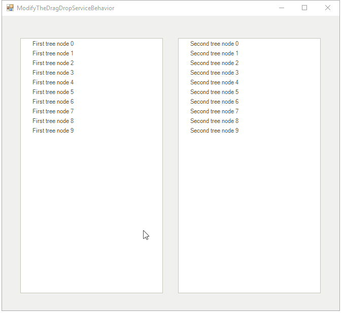

# Modify the DragDropService behavior

This article demonstrates how to customize the __TreeViewDragDropService__ behavior and more precisely how to customize it to copy the nodes when dropped, instead of moving them.

To achieve this scenario we will need to create a descendant of TreeViewDragDropService (lets call it CustomDragDropService) where we will expose the RadTreeViewElement as a field, so we can use it later. This field will be assigned in the CustomDragDropService class constructor. We will also need another field of type RadTreeNode which will hold the dragged node. The latter will be assigned in the __PerformStart__ and will be cleared in the __PerformStop__ method.

Next we need to override the __OnPreviewDragOver__ method, where we will specify upon what conditions a drop will be allowed and finally, in the __OnPreviewDragDrop__ method override, we will add the logic for copying the selected nodes instead of moving them:

<snippet id='treeview-customdragdropservice-customdragdropservice-cs' />
<snippet id='treeview-customdragdropservice-customdragdropservice-vb' />

After the custom drag and drop behavior is created, we need to replace the default one. This can be achieved in the __CreateDragDropService__ method of RadTreeViewElement, so we create a new element for the purpose:

<snippet id='treeview-customtreeviewelement-customtreeviewelement-cs' />
<snippet id='treeview-customtreeviewelement-customtreeviewelement-vb' />

Now we need to use this CustomTreeViewElement in the tree. To do that we need to pass a new instance of this element in the __CreateTreeViewElement__ method of RadTreeView descendant:

<snippet id='treeview-customtreeview-customtreeview-cs' />
<snippet id='treeview-customtreeview-customtreeview-vb' />

Finally, lets populate the tree and test the new behavior:

<snippet id='treeview-modifythedragdropservicebehavior-populatethetree-cs' />
<snippet id='treeview-modifythedragdropservicebehavior-populatethetree-vb' />

The result can be observed at the screen shot at the top.

# See Also
* [Cancel a Drag and Drop Operation]()

* [Drag and Drop in bound mode]()

* [Enabling Drag and Drop]()

