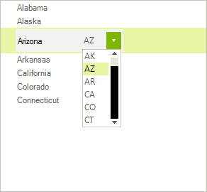

# Custom Editors

By default RadTreeView uses a text box editor for editing the node __Text__. However, you might want to replace the default editor with your own. When an editor is invoked the __EditorRequired__ event fires allowing the editor instance to be replaced by a custom one.

## 

Below you will find an example on how to implement a custom editor and use it with RadTreeView.
        

In this example we will implement an editor, showing a US state name with text and its abbreviation in a drop down next to the text.



Our editor and its element will derive from __BaseTextBoxEditor__ and __BaseTextBoxEditorElement__ respectively.
        

In the __EditorElement__ we will add a __RadDropDownListElement__. The DropDownList will be bound to the same data source as the RadTreeView control for the purpose of the example follows the EditorElement:

{{source=..\SamplesCS\TreeView\WorkingWithNodes\EditingNodes.cs region=CustomTreeViewEditorElement}} 
{{source=..\SamplesVB\TreeView\WorkingWithNodes\EditingNodes.vb region=CustomTreeViewEditorElement}} 

````C#
public class CustomRadTreeViewEditorElement : BaseTextBoxEditorElement
{
    private RadDropDownListElement dropDownList;
    private DockLayoutPanel dockPanel;
    public RadDropDownListElement DropDownList
    {
        get { return this.dropDownList; }
    }
    protected override void OnLoaded() //use OnLoaded as here the text editor will exist
    {
        base.OnLoaded();
        if (this.Children.Contains(this.TextBoxItem))
        {
            this.dropDownList = new RadDropDownListElement();
            this.dropDownList.DropDownStyle = RadDropDownStyle.DropDownList;
            this.dropDownList.MinSize = new Size(55, 0);
            this.dockPanel = new DockLayoutPanel();
            this.dockPanel.LastChildFill = true;
            this.Children.Add(this.dockPanel);
            this.dockPanel.Children.Add(this.dropDownList);
            DockLayoutPanel.SetDock(this.dropDownList, Telerik.WinControls.Layouts.Dock.Right);
            this.Children.Remove(this.TextBoxItem);
            this.dockPanel.Children.Add(this.TextBoxItem);
        }
    }
}

````
````VB.NET
Public Class CustomRadTreeViewEditorElement
Inherits BaseTextBoxEditorElement
    Private m_dropDownList As RadDropDownListElement
    Private dockPanel As DockLayoutPanel
    Public ReadOnly Property DropDownList() As RadDropDownListElement
        Get
            Return Me.m_dropDownList
        End Get
    End Property
    Protected Overrides Sub OnLoaded()
        'use OnLoaded as here the text editor will exist
        MyBase.OnLoaded()
        If Me.Children.Contains(Me.TextBoxItem) Then
            Me.m_dropDownList = New RadDropDownListElement()
            Me.m_dropDownList.DropDownStyle = RadDropDownStyle.DropDownList
            Me.m_dropDownList.MinSize = New Size(55, 0)
            Me.dockPanel = New DockLayoutPanel()
            Me.dockPanel.LastChildFill = True
            Me.Children.Add(Me.dockPanel)
            Me.dockPanel.Children.Add(Me.m_dropDownList)
            DockLayoutPanel.SetDock(Me.m_dropDownList, Telerik.WinControls.Layouts.Dock.Right)
            Me.Children.Remove(Me.TextBoxItem)
            Me.dockPanel.Children.Add(Me.TextBoxItem)
        End If
    End Sub
End Class

````

{{endregion}} 

The __EditorElement__ encapsulates the visual appearance of the element, we will need the actual editor which will encapsulate the functionality:

{{source=..\SamplesCS\TreeView\WorkingWithNodes\EditingNodes.cs region=CustomTreeViewEditor}} 
{{source=..\SamplesVB\TreeView\WorkingWithNodes\EditingNodes.vb region=CustomTreeViewEditor}} 

````C#
public class CustomRadTreeViewEditor : BaseTextBoxEditor
{
    protected override RadElement CreateEditorElement()
    {
        return new CustomRadTreeViewEditorElement();
    }
    public new CustomRadTreeViewEditorElement EditorElement
    {
        get { return base.EditorElement as CustomRadTreeViewEditorElement; }
    }
    public override bool EndEdit()
    {
        this.EditorElement.DropDownList.SelectedValueChanged -= DropDownList_SelectedIndexChanged;
        return base.EndEdit();
    }
    public override void BeginEdit()
    {
        base.BeginEdit();
        TreeNodeElement nodeElement = this.OwnerElement as TreeNodeElement;
        this.EditorElement.DropDownList.BindingContext = new BindingContext();
        this.EditorElement.DropDownList.DataSource = nodeElement.TreeViewElement.DataSource;
        this.EditorElement.DropDownList.DisplayMember = nodeElement.TreeViewElement.ValueMember;
        this.EditorElement.DropDownList.ValueMember = nodeElement.TreeViewElement.DisplayMember;
        this.EditorElement.DropDownList.SelectedIndex = this.EditorElement.DropDownList.FindStringExact(nodeElement.Data.Value.ToString());
        this.Value = nodeElement.Data.Text;
        this.EditorElement.DropDownList.SelectedIndexChanged += DropDownList_SelectedIndexChanged;
    }
    void DropDownList_SelectedIndexChanged(object sender, Telerik.WinControls.UI.Data.PositionChangedEventArgs e)
    {
        TreeNodeElement nodeElement = this.OwnerElement as TreeNodeElement;
        nodeElement.Data.Value = this.EditorElement.DropDownList.Items[e.Position].Text;
        this.Value = this.EditorElement.DropDownList.Items[e.Position].Value;
    }
}

````
````VB.NET
Public Class CustomRadTreeViewEditor
Inherits BaseTextBoxEditor
    Protected Overrides Function CreateEditorElement() As RadElement
        Return New CustomRadTreeViewEditorElement()
    End Function
    Public Shadows ReadOnly Property EditorElement() As CustomRadTreeViewEditorElement
        Get
            Return TryCast(MyBase.EditorElement, CustomRadTreeViewEditorElement)
        End Get
    End Property
    Public Overrides Function EndEdit() As Boolean
        RemoveHandler Me.EditorElement.DropDownList.SelectedValueChanged, AddressOf DropDownList_SelectedIndexChanged
        Return MyBase.EndEdit()
    End Function
    Public Overrides Sub BeginEdit()
        MyBase.BeginEdit()
        Dim nodeElement As TreeNodeElement = TryCast(Me.OwnerElement, TreeNodeElement)
        Me.EditorElement.DropDownList.BindingContext = New BindingContext()
        Me.EditorElement.DropDownList.DataSource = nodeElement.TreeViewElement.DataSource
        Me.EditorElement.DropDownList.DisplayMember = nodeElement.TreeViewElement.ValueMember
        Me.EditorElement.DropDownList.ValueMember = nodeElement.TreeViewElement.DisplayMember
        Me.EditorElement.DropDownList.SelectedIndex = Me.EditorElement.DropDownList.FindStringExact(nodeElement.Data.Value.ToString())
        Me.Value = nodeElement.Data.Text
        AddHandler Me.EditorElement.DropDownList.SelectedIndexChanged, AddressOf DropDownList_SelectedIndexChanged
    End Sub
    Private Sub DropDownList_SelectedIndexChanged(sender As Object, e As Telerik.WinControls.UI.Data.PositionChangedEventArgs)
        Dim nodeElement As TreeNodeElement = TryCast(Me.OwnerElement, TreeNodeElement)
        nodeElement.Data.Value = Me.EditorElement.DropDownList.Items(e.Position).Text
        Me.Value = Me.EditorElement.DropDownList.Items(e.Position).Value
    End Sub
End Class

````

{{endregion}} 

Now all that is left is to drag a RadTreeView to a form, populate it with data and enable the custom editor.

{{source=..\SamplesCS\TreeView\WorkingWithNodes\EditingNodes.cs region=Initialization}} 
{{source=..\SamplesVB\TreeView\WorkingWithNodes\EditingNodes.vb region=Initialization}} 

````C#
public EditingNodes()
{
    InitializeComponent();
    DataTable table = new DataTable();
    table.Columns.Add("Abbreviation");
    table.Columns.Add("State");
    table.Rows.Add("AL", "Alabama");
    table.Rows.Add("AK", "Alaska");
    table.Rows.Add("AZ", "Arizona");
    table.Rows.Add("AR", "Arkansas");
    table.Rows.Add("CA", "California");
    table.Rows.Add("CO", "Colorado");
    table.Rows.Add("CT", "Connecticut");
    this.Controls.Add(this.radTreeView1);
    this.radTreeView1.AllowEdit = true;
    this.radTreeView1.DataSource = table;
    this.radTreeView1.DisplayMember = "State";
    this.radTreeView1.ValueMember = "Abbreviation";
    this.radTreeView1.EditorRequired += TreeViewEditorRequired;
}
private void TreeViewEditorRequired(object sender, TreeNodeEditorRequiredEventArgs e)
{
    e.EditorType = typeof(CustomRadTreeViewEditor);
}

````
````VB.NET
Public Sub New()
    InitializeComponent()
    Dim table As New DataTable()
    table.Columns.Add("Abbreviation")
    table.Columns.Add("State")
    table.Rows.Add("AL", "Alabama")
    table.Rows.Add("AK", "Alaska")
    table.Rows.Add("AZ", "Arizona")
    table.Rows.Add("AR", "Arkansas")
    table.Rows.Add("CA", "California")
    table.Rows.Add("CO", "Colorado")
    table.Rows.Add("CT", "Connecticut")
    Me.Controls.Add(Me.radTreeView1)
    Me.radTreeView1.AllowEdit = True
    Me.radTreeView1.DataSource = table
    Me.radTreeView1.DisplayMember = "State"
    Me.radTreeView1.ValueMember = "Abbreviation"
    AddHandler Me.radTreeView1.EditorRequired, AddressOf TreeViewEditorRequired
End Sub
Private Sub TreeViewEditorRequired(sender As Object, e As TreeNodeEditorRequiredEventArgs)
    e.EditorType = GetType(CustomRadTreeViewEditor)
End Sub

````

{{endregion}}

# See Also

* [Editing Nodes]()
* [Simulate TreeList Control with Load on Demand]()

