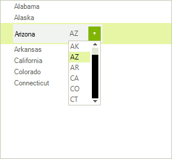

# Custom Editors

By default RadTreeView uses a text box editor for editing the node __Text__. However, you might want to replace the default editor with your own. When an editor is invoked the __EditorRequired__ event fires allowing the editor instance to be replaced by a custom one.

## 

Below you will find an example on how to implement a custom editor and use it with RadTreeView.
        

In this example we will implement an editor, showing a US state name with text and its abbreviation in a drop down next to the text.

Our editor and its element will derive from __BaseTextBoxEditor__ and __BaseTextBoxEditorElement__ respectively.
        

In the __EditorElement__ we will add a __RadDropDownListElement__. The DropDownList will be bound to the same data source as the RadTreeView control for the purpose of the example follows the EditorElement:

<snippet id='treeview-editingnodes-customtreevieweditorelement-cs' />
<snippet id='treeview-editingnodes-customtreevieweditorelement-vb' />

The __EditorElement__ encapsulates the visual appearance of the element, we will need the actual editor which will encapsulate the functionality:

<snippet id='treeview-editingnodes-customtreevieweditor-cs' />
<snippet id='treeview-editingnodes-customtreevieweditor-vb' />

Now all that is left is to drag a RadTreeView to a form, populate it with data and enable the custom editor.

<snippet id='treeview-editingnodes-initialization-cs' />
<snippet id='treeview-editingnodes-initialization-vb' />

# See Also

* [Editing Nodes]()
* [Simulate TreeList Control with Load on Demand]()

