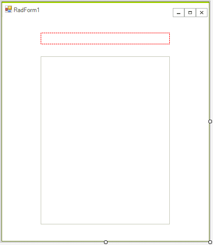
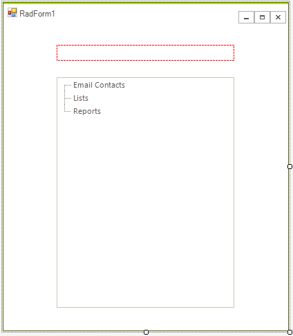
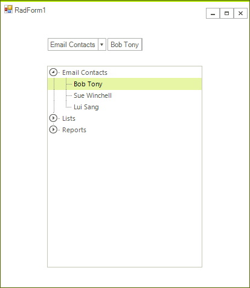

# Getting Started with WinForms TreeView

This tutorial will help you to quickly get started using the control.

## Adding Telerik Assemblies Using NuGet

To use `RadTreeView` when working with NuGet packages, install the `Telerik.UI.for.WinForms.AllControls` package. The [package target framework version may vary]().

Read more about NuGet installation in the [Install using NuGet Packages]() article.

>tip With the 2025 Q1 release, the Telerik UI for WinForms has a new licensing mechanism. You can learn more about it [here]().

## Adding Assembly References Manually

When dragging and dropping a control from the Visual Studio (VS) Toolbox onto the Form Designer, VS automatically adds the necessary assemblies. However, if you're adding the control programmatically, you'll need to manually reference the following assemblies:

* __Telerik.Licensing.Runtime__
* __Telerik.WinControls__
* __Telerik.WinControls.UI__
* __TelerikCommon__

The Telerik UI for WinForms assemblies can be install by using one of the available [installation approaches](). 

## Defining the RadTreeView

The following tutorial will help you get started working with the __RadTreeView__ at design time and programmatically. Topics included are: 

* Associating breadcrumb component to the __RadTreeView.__

* Using the __RadTreeView__ designer to add and configure nodes.

* Programmatically adding and configuring nodes.

##  Getting Started Tutorial

1. Create a new Windows Forms Application.

1. On the form add a __RadBreadCrumb__ and __RadTreeView__.

1. In the `Properties` window  for the __RadBreadCrumb__ set the __DefaultTreeView__ property to point to the __RadTreeView__. The design should now look like this.
    
    

1. Drop the __TelerikMetro__ theme form the tool box and set all controls __ThemeName__ property to __TelerikMetro__.

1. Right click the __RadTreeView__ and select __Open Property Builder__ from the context menu. You will see a set of buttons on the left side of the __RadTreeView__ Property Builder and a preview of the tree view below the buttons. See [Property Builder]() topic for a complete tour of functionality.

1. Click the far left button (a green "Plus" button that adds nodes) three times to add three nodes.

1. Click the first node and enter "Email Contacts" in the Text entry.

1. Click the second node and enter "Lists" in the __Text__ entry.
            

1. Click the third node and enter "Reports" in the __Text__ entry.
            

1. Click the RadTreeView Properties tab located in the left part of the Window.

1. Check __Show Lines__.
            

1. Click OK to close the Property Builder.The design should now look like the screenshot below.

    

1. In the form code add a "using" statement for Telerik.WinControls.UI

1. In the form's constructor add the code appearing below the __InitializeComponent()__ method call. This code creates new __RadTreeNode__ objects, populates them with text and attaches them to parent nodes.


{{source=..\SamplesCS\TreeView\GettingStarted.cs region=GettingStarted}} 
{{source=..\SamplesVB\TreeView\TreeViewGettingStarted.vb region=GettingStarted}} 

````C#
            
RadTreeNode node = radTreeView1.Nodes["Email Contacts"].Nodes.Add("Bob Tony");
node.Selected = true;
            
radTreeView1.Nodes["Email Contacts"].Nodes.Add("Sue Winchell");
radTreeView1.Nodes["Email Contacts"].Nodes.Add("Lui Sang");
radTreeView1.Nodes["Lists"].Nodes.Add("Priorities");
radTreeView1.Nodes["Lists"].Nodes.Add("Opportunities");
radTreeView1.Nodes["Lists"].Nodes.Add("Issues");
            
node = radTreeView1.Nodes["Reports"].Nodes.Add("June Sales");
node = radTreeView1.Nodes["Reports"].Nodes.Add("July Sales");
node = radTreeView1.Nodes["Reports"].Nodes.Add("First Quarter Summary");
node = radTreeView1.Nodes["Reports"].Nodes.Add("Second Quarter Summary");

````
````VB.NET
Dim node As RadTreeNode = RadTreeView1.Nodes("Email Contacts").Nodes.Add("Bob Tony")
node.Selected = True
RadTreeView1.Nodes("Email Contacts").Nodes.Add("Sue Winchell")
RadTreeView1.Nodes("Email Contacts").Nodes.Add("Lui Sang")
RadTreeView1.Nodes("Lists").Nodes.Add("Priorities")
RadTreeView1.Nodes("Lists").Nodes.Add("Opportunities")
RadTreeView1.Nodes("Lists").Nodes.Add("Issues")
node = RadTreeView1.Nodes("Reports").Nodes.Add("June Sales")
node = RadTreeView1.Nodes("Reports").Nodes.Add("July Sales")
node = RadTreeView1.Nodes("Reports").Nodes.Add("First Quarter Summary")
node = RadTreeView1.Nodes("Reports").Nodes.Add("Second Quarter Summary")

````

{{endregion}} 

14\. Run the application.



## See Also
* [Breadcrumb]()

* [Properties, Methods and Events]()

* [Structure]()


## Telerik UI for WinForms Learning Resources
* [Telerik UI for WinForms TreeView Component](https://www.telerik.com/products/winforms/treeview.aspx)
* [Getting Started with Telerik UI for WinForms Components](https://docs.telerik.com/devtools/winforms/getting-started/first-steps)
* [Telerik UI for WinForms Setup](https://docs.telerik.com/devtools/winforms/installation-and-upgrades/installing-on-your-computer)
* [Telerik UI for WinForms Application Modernization](https://docs.telerik.com/devtools/winforms/winforms-converter/overview)
* [Telerik UI for WinForms Visual Studio Templates](https://docs.telerik.com/devtools/winforms/visual-studio-integration/visual-studio-templates)
* [Deploy Telerik UI for WinForms Applications](https://docs.telerik.com/devtools/winforms/deployment-and-distribution/application-deployment)
* [Telerik UI for WinForms Virtual Classroom(Training Courses for Registered Users)](https://learn.telerik.com/learn/course/external/view/elearning/17/telerik-ui-for-winforms)
* [Telerik UI for WinForms License Agreement)](https://www.telerik.com/purchase/license-agreement/winforms-dlw-s)

