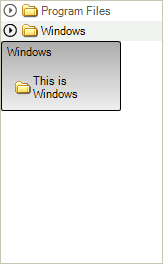

# Assign RadScreenTip to nodes

In order to assign __RadScreenTip__ to the nodes of RadTreeView you should use the __ScreenTipNeeded__ event.

If the item which needs a ScreenTip is a TreeNodeElement, you set the necessary properties of the globally instantiated __RadOffice2007ScreenTip__:

<snippet id='treeview-treescreentips-screentip-cs' />
<snippet id='treeview-treescreentips-screentip-vb' />

# See Also
* [Keep RadTreeView states on reset]()

