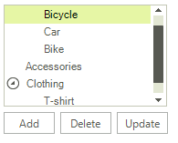
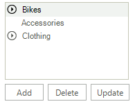
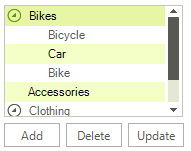
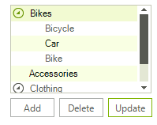

# Keep RadTreeView states on reset

The __RadTreeView__ is a control that allows you to visualize hierarchical structures of data in the form of a tree. However, when in bound mode, when a change in the underlying data source occurs, the tree needs to repopulate itself in order to get the latest changes. As a result, the __Expanded__ state of the available nodes, selection and scroll bar position are not kept. This article explains how to save the tree state prior the change and restore it afterwards.

The following code snippet demonstrates how to populate the __RadTreeView__ with hierarchical data.

<snippet id='treeview-keeptreeviewstates-bindtoobjectrelationaldata-cs' />
<snippet id='treeview-keeptreeviewstates-bindtoobjectrelationaldata-vb' />

On the left figure, you can see the tree with some selected and expanded nodes and the scroll bar in the middle of the tree. On the right figure, you see how the tree is collapsed after we add a node to its data source.

|Initial state|After a change in the data source occurs|
|-----|-----|
|||

Unfortunately, a solution of this cannot be added to the control as it depends on the case and there has to be logic added for the specific case to be handled. To keep the expanded and selected state of RadTreeView after a change in the data source occurs, we can use a Dictionary with some unique value for a key i.e. this could be the node’s Text, DataBoundItem, Value, or even an ID taken from the DataBoundItem and store the state for the node in it. The following example demonstrates how to create a simple structure - State, which will hold and describe the state of a node. The __SaveExpandedStates__ method is used to recursively iterate all nodes in RadTreeView and populate a dictionary with the nodes information. The __RestoreExpandedStates__ method is used to read the saved states from the dictionary, find the respective node and restore its state.

<snippet id='treeview-keeptreeviewstates-saverestore-cs' />
<snippet id='treeview-keeptreeviewstates-saverestore-vb' />

Once we have these methods implemented, we can use the dictionary to save the RadTreeView state prior the change occurs and restore it afterwards. In the example below, we are also saving and restoring the scroll bar position.

<snippet id='treeview-keeptreeviewstates-keeptreeviewstates-cs' />
<snippet id='treeview-keeptreeviewstates-keeptreeviewstates-vb' />

Now, using these methods the tree states will be restored accordingly.

|Initial state|After a change in the data source occurs|
|------|------|
|||

# See Also
* [Assign RadScreenTip to nodes]()

