# Themes

The control is shipped with a rich set of themes that allow you to easily build slick interfaces with the look-and-feel of Windows, Office, Outlook, etc. The themes can be easily switched using a single property.

|   |   |
|---|---|
|TelerikMetro |Office2013Dark 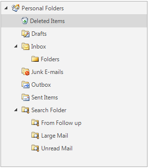|
|Office2013Light 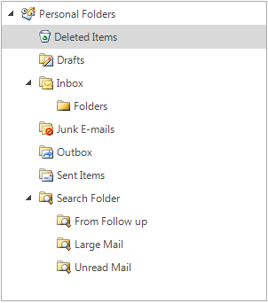|Windows 8 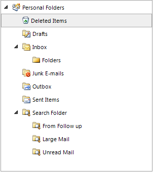|
|VisualStudio2012Dark 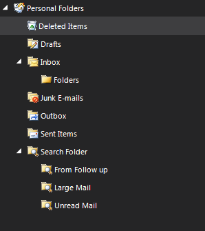|VisualStudio2012Light 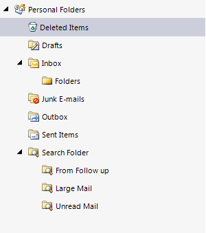|
|TelerikMetroBlue 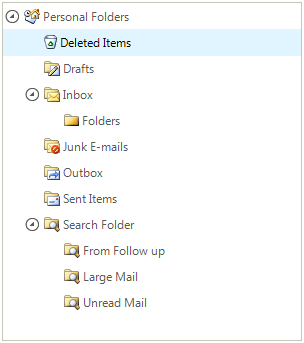|Office2010Black 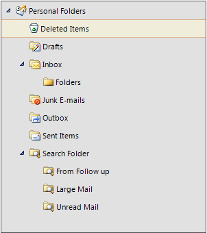|
|Office2010Silver 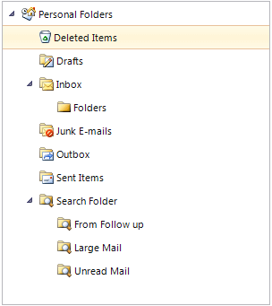|ControlDefault 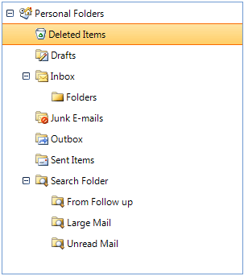|
|Aqua 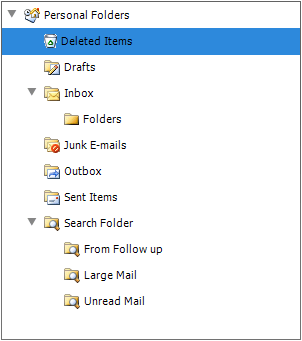|Breeze 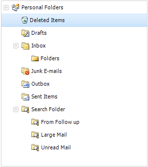|
|Desert 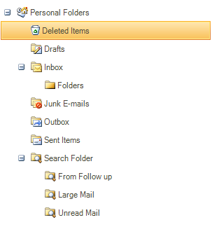|HighContrastBlack |
|Office2007Black 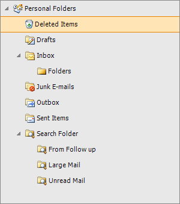|Office2007Silver 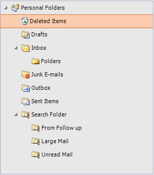|
|Windows7 |Office2010Blue 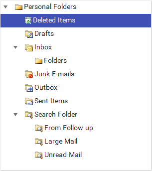|
|Material |MaterialTeal 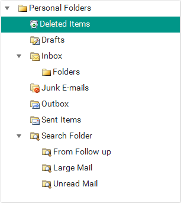|
|MaterialBlueGrey 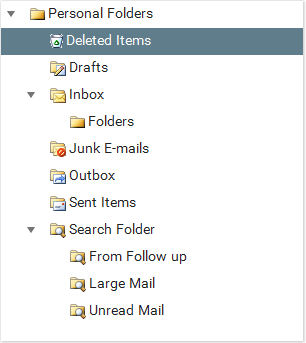|MaterialPink 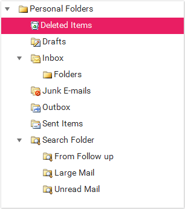|
|Crystal 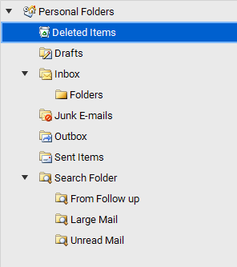|CrystalDark 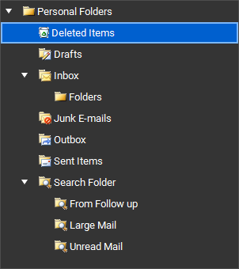|
|Fluent 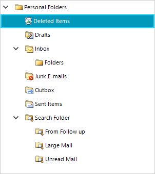|FluentDark 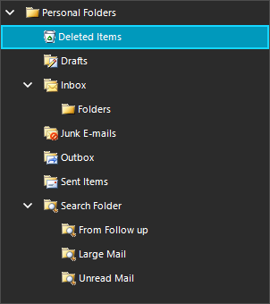|

# See Also
* [Tree Lines and Rows]()

