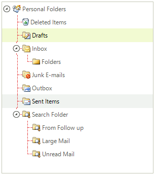
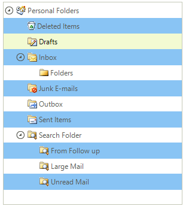

# Tree Lines and Rows


To display lines connecting nodes in RadTreeView set the __ShowLines__ property to *true*. Control the appearance of the lines using the __LineStyle__ and __LineColor__ properties. __LineStyle__ is of type __TreeLineStyle__ and includes the following members __Solid__, __Dash__,  __Dot__, __DashDot__, __DashDotDot__.


{{source=..\SamplesCS\TreeView\GettingStarted.cs region=lines}} 
{{source=..\SamplesVB\TreeView\TreeViewGettingStarted.vb region=lines}} 

````C#
            
radTreeView1.ShowLines = true;
radTreeView1.LineStyle = TreeLineStyle.DashDot;

````
````VB.NET
RadTreeView1.ShowLines = True
RadTreeView1.LineStyle = TreeLineStyle.DashDot

````

{{endregion}} 




To select rows spanning the entire width of RadTreeView (rather than just the node label), set the __FullRowSelect__ property to *true* and __ShowLines__ to *false*. In addition you can set the alternating row color by setting the __AllowAlternatingRowColor__ and __AlternatingRowColor__ properties.

{{source=..\SamplesCS\TreeView\GettingStarted.cs region=AlternatingRowColor}} 
{{source=..\SamplesVB\TreeView\TreeViewGettingStarted.vb region=AlternatingRowColor}} 

````C#
        
radTreeView1.TreeViewElement.AllowAlternatingRowColor = true;
radTreeView1.TreeViewElement.AlternatingRowColor = Color.LightBlue;

````
````VB.NET
RadTreeView1.TreeViewElement.AllowAlternatingRowColor = True
RadTreeView1.TreeViewElement.AlternatingRowColor = Color.LightBlue

````

{{endregion}} 




# See Also
* [Themes]()

