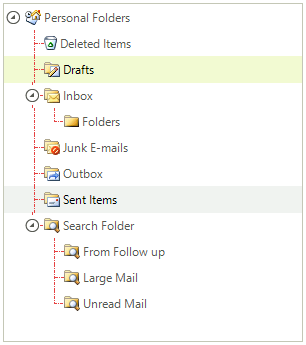
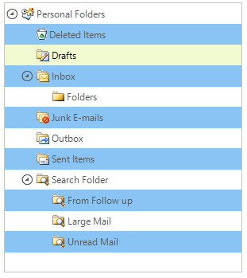

# Tree Lines and Rows

To display lines connecting nodes in RadTreeView set the __ShowLines__ property to *true*. Control the appearance of the lines using the __LineStyle__ and __LineColor__ properties. __LineStyle__ is of type __TreeLineStyle__ and includes the following members __Solid__, __Dash__,  __Dot__, __DashDot__, __DashDotDot__.

<snippet id='treeview-gettingstarted-lines-cs' />
<snippet id='treeview-treeviewgettingstarted-lines-vb' />

To select rows spanning the entire width of RadTreeView (rather than just the node label), set the __FullRowSelect__ property to *true* and __ShowLines__ to *false*. In addition you can set the alternating row color by setting the __AllowAlternatingRowColor__ and __AlternatingRowColor__ properties.

<snippet id='treeview-gettingstarted-alternatingrowcolor-cs' />
<snippet id='treeview-treeviewgettingstarted-alternatingrowcolor-vb' />

# See Also
* [Themes]()

