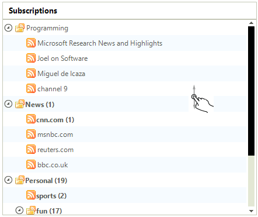
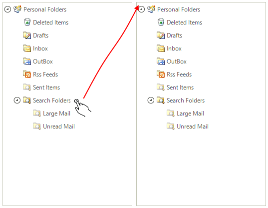
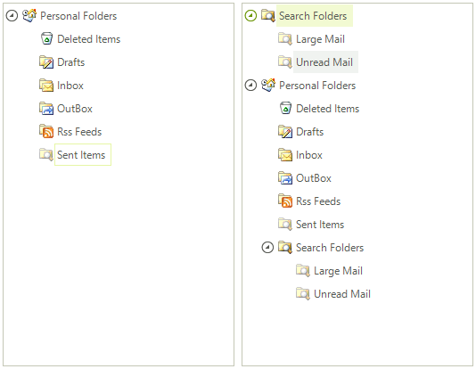

# Touch Support

RadTreeView supports both scrolling and dragging operations via touch device.

## Scrolling

To scroll the nodes simply drag the whole control to the desired location (left, right, up, down).

Here is the result of scrolling the control down:

## Dragging

To drag a node together with its children to a new position, simply drag the desired node to the desired position and it will be moved there together with its children if such exists

Here you can see the dragged "*Search Folders*" section from the bottom of the left tree to the top of the right one

# See Also

 * [Windows Touch Gestures](http://msdn.microsoft.com/en-us/library/windows/desktop/dd940543(v=vs.85).aspx)
