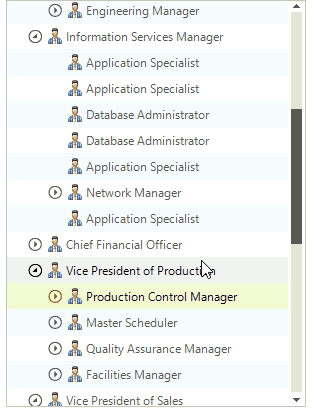

# Kinetic Scrolling

The Kinetic Scrolling is a functionality that allows you to scroll by directly dragging the items. The bellow image show how it can be used.

    

# See Also

* [Keyboard Navigation]() 
