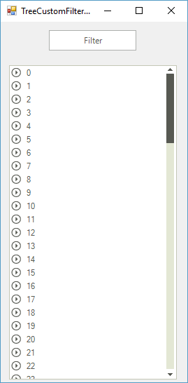
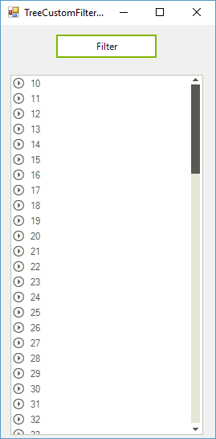

# Custom Filtering

Custom filtering is a flexible mechanism for filtering RadTreeView nodes by using custom logic. It has a higher priority than the applied FilterDescriptors.

In order to apply custom logic for filtering, you have to create a [Predicate](http://msdn.microsoft.com/en-us/library/bfcke1bz.aspx). Here is an example of a __Predicate__ which will return just the nodes which text is longer than one char:
        

#### Creating predicate

<snippet id='treeview-treecustomfiltering-customfiltering2-cs' />
<snippet id='treeview-treecustomfiltering-customfiltering2-vb' />

| Here you have nodes from 1-100 | After the filtering the nodes are only from 10-100, since nodes 1-9 contain just one char as text |
| ------ | ------ |
|||

To set the __Predicate__ to RadTreeView, use the __FilterPredicate__ property of the control:
    	
#### Applying predicate

<snippet id='treeview-treecustomfiltering-customfiltering1-cs' />
<snippet id='treeview-treecustomfiltering-customfiltering1-vb' />

At the end, in order to apply the filter to the control, just set the __Filter__ property to any string, which will invoke the filtering operation:
    	
#### Invoke filtering

<snippet id='treeview-treecustomfiltering-customfiltering3-cs' />
<snippet id='treeview-treecustomfiltering-customfiltering3-vb' />

# See Also
* [Adding and Removing Nodes]()

* [Bring a Node into View]()

* [Custom Nodes]()

* [Custom Sorting]()

* [Events]()

* [Filtering Nodes]()

