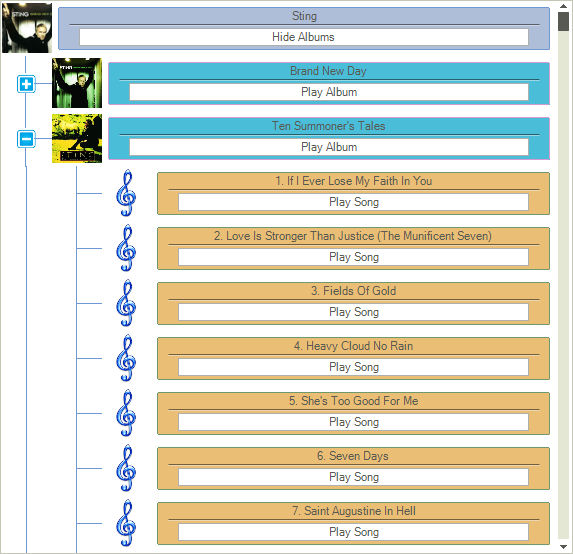

# Custom Nodes


With __RadTreeView__ you can create custom nodes and display them instead of the default ones. This can be done by creating a custom __TreeNodeElement__, which will replace the default one in the __CreateNodeElement__ event handler. This article demonstrates how this approach can be implemented.



To create this example you can first prepare a project by following the steps in [this article]()


1\. First we can create a custom __TreeNodeContentElement__ class which contains the main elements for the custom node. These elements are created and initialized in the __CreateChildElements__ method. Also the __Synchronize__ method is overridden for setting the elements properties in accordance with the corresponding data:

{{source=..\SamplesCS\TreeView\WorkingWithNodes\CustomNodes.cs region=CustomContentElement}} 
{{source=..\SamplesVB\TreeView\WorkingWithNodes\CustomNodes.vb region=CustomContentElement}} 

````C#
    
class CustomContentElement : TreeNodeContentElement
{
    StackLayoutElement nodeContentContainer;
    LinePrimitive lineElement;
    LightVisualElement textElement;
    RadButtonElement buttonElement;
                   
    protected override Type ThemeEffectiveType
    {
        get
        {
            return typeof(TreeNodeContentElement);
        }
    }
    protected override void InitializeFields()
    {
        base.InitializeFields();
        this.DrawBorder = true;
        this.NumberOfColors = 2;
        this.GradientStyle = GradientStyles.Linear;
        this.Margin = new Padding(5, 5, 5, 5);
        this.Shape = new RoundRectShape(2);
        this.StretchHorizontally = true;
    }
    public override void Synchronize()
    {
        this.DrawFill = true;
        
        TreeNodeElement treeNodeElement = this.NodeElement;
        RadTreeNode node = treeNodeElement.Data;
        DataRowView rowView = (DataRowView)node.DataBoundItem;
            
        if (node.Level == 0)
        {
            this.textElement.Text = "" + rowView["ArtistName"];
            if (node.Expanded == false)
            {
                buttonElement.Text = "Show Albums";
            }
            else
            {
                buttonElement.Text = "Hide Albums";
            }
            
            this.BorderColor = Color.FromArgb(110, 153, 210);
            this.BackColor = Color.FromArgb(174, 190, 217);
            this.BackColor2 = Color.FromArgb(168, 183, 210);
        }
        else if (node.Level == 1)
        {
            this.textElement.Text = "" + rowView["AlbumName"];
            this.buttonElement.Text = "Play Album";
            
            this.BorderColor = Color.FromArgb(210, 153, 210);
            this.BackColor = Color.FromArgb(74, 190, 217);
            this.BackColor2 = Color.FromArgb(50, 150, 190);
        }
        else
        {
            this.textElement.Text = "" + rowView["SongName"];
            this.buttonElement.Text = "Play Song";
            
            this.BorderColor = Color.FromArgb(110, 153, 110);
            this.BackColor = Color.FromArgb(234, 190, 117);
            this.BackColor2 = Color.FromArgb(208, 183, 110);
        }
    }
        
    protected override void CreateChildElements()
    {
        nodeContentContainer = new StackLayoutElement();
        nodeContentContainer.Orientation = Orientation.Vertical;
        nodeContentContainer.StretchHorizontally = true;
        nodeContentContainer.StretchVertically = false;
        
        textElement = new LightVisualElement();
        textElement.ShouldHandleMouseInput = false;
        textElement.NotifyParentOnMouseInput = true;
        textElement.StretchVertically = false;
        this.nodeContentContainer.Children.Add(textElement);
        
        lineElement = new LinePrimitive();
        lineElement.BackColor = Color.Black;
        lineElement.Margin = new Padding(10, 0, 10, 0);
        lineElement.StretchVertically = false;
        this.nodeContentContainer.Children.Add(lineElement);
        
        buttonElement = new RadButtonElement();
        buttonElement.Margin = new Padding(20, 3, 20, 3);
        buttonElement.Click += buttonElement_Click;
        buttonElement.StretchVertically = false;
        this.nodeContentContainer.Children.Add(buttonElement);
        
        this.Children.Add(nodeContentContainer);
    }
        
    void buttonElement_Click(object sender, EventArgs e)
    {
        TreeNodeElement treeNodeElement = this.NodeElement;
        RadTreeNode node = treeNodeElement.Data;
        if (node.Level == 0)
        {
            if (node.Expanded == true)
            {
                node.Collapse();
                buttonElement.Text = "Show Albums";
            }
            else
            {
                node.Expand();
                buttonElement.Text = "Hide Albums";
            }
        }
    }
}

````
````VB.NET
Class CustomContentElement
    Inherits TreeNodeContentElement
    Private nodeContentContainer As StackLayoutElement
    Private lineElement As LinePrimitive
    Private textElement As LightVisualElement
    Private buttonElement As RadButtonElement
    Protected Overrides ReadOnly Property ThemeEffectiveType() As Type
        Get
            Return GetType(TreeNodeContentElement)
        End Get
    End Property
    Protected Overrides Sub InitializeFields()
        MyBase.InitializeFields()
        Me.DrawBorder = True
        Me.NumberOfColors = 2
        Me.GradientStyle = GradientStyles.Linear
        Me.Margin = New Padding(5, 5, 5, 5)
        Me.Shape = New RoundRectShape(2)
        Me.StretchHorizontally = True
    End Sub
    Public Overrides Sub Synchronize()
        Me.DrawFill = True
        Dim treeNodeElement As TreeNodeElement = Me.NodeElement
        Dim node As RadTreeNode = treeNodeElement.Data
        Dim rowView As DataRowView = DirectCast(node.DataBoundItem, DataRowView)
        If node.Level = 0 Then
            Me.textElement.Text = rowView("ArtistName")
            If node.Expanded = False Then
                buttonElement.Text = "Show Albums"
            Else
                buttonElement.Text = "Hide Albums"
            End If
            Me.BorderColor = Color.FromArgb(110, 153, 210)
            Me.BackColor = Color.FromArgb(174, 190, 217)
            Me.BackColor2 = Color.FromArgb(168, 183, 210)
        ElseIf node.Level = 1 Then
            Me.textElement.Text = rowView("AlbumName")
            Me.buttonElement.Text = "Play Album"
            Me.BorderColor = Color.FromArgb(210, 153, 210)
            Me.BackColor = Color.FromArgb(74, 190, 217)
            Me.BackColor2 = Color.FromArgb(50, 150, 190)
        Else
            Me.textElement.Text = rowView("SongName")
            Me.buttonElement.Text = "Play Song"
            Me.BorderColor = Color.FromArgb(110, 153, 110)
            Me.BackColor = Color.FromArgb(234, 190, 117)
            Me.BackColor2 = Color.FromArgb(208, 183, 110)
        End If
    End Sub
    Protected Overrides Sub CreateChildElements()
        nodeContentContainer = New StackLayoutElement()
        nodeContentContainer.Orientation = Orientation.Vertical
        nodeContentContainer.StretchHorizontally = True
        nodeContentContainer.StretchVertically = False
        textElement = New LightVisualElement()
        textElement.ShouldHandleMouseInput = False
        textElement.NotifyParentOnMouseInput = True
        textElement.StretchVertically = False
        Me.nodeContentContainer.Children.Add(textElement)
        lineElement = New LinePrimitive()
        lineElement.BackColor = Color.Black
        lineElement.Margin = New Padding(10, 0, 10, 0)
        lineElement.StretchVertically = False
        Me.nodeContentContainer.Children.Add(lineElement)
        buttonElement = New RadButtonElement()
        buttonElement.Margin = New Padding(20, 3, 20, 3)
        AddHandler buttonElement.Click, AddressOf buttonElement_Click
        buttonElement.StretchVertically = False
        Me.nodeContentContainer.Children.Add(buttonElement)
        Me.Children.Add(nodeContentContainer)
        Me.Shape = New RoundRectShape(2)
        Me.StretchHorizontally = True
    End Sub
    Private Sub buttonElement_Click(sender As Object, e As EventArgs)
        Dim treeNodeElement As TreeNodeElement = Me.NodeElement
        Dim node As RadTreeNode = treeNodeElement.Data
        If node.Level = 0 Then
            If node.Expanded = True Then
                node.Collapse()
                buttonElement.Text = "Show Albums"
            Else
                node.Expand()
                buttonElement.Text = "Hide Albums"
            End If
        End If
    End Sub
End Class

````

{{endregion}} 

2\. Now we can use the already created __CustomContentElement__ and create a custom __TreeNodeElement__ class. Also here the __Synchronize__ method is overridden in order to set the picture of the node:

{{source=..\SamplesCS\TreeView\WorkingWithNodes\CustomNodes.cs region=CustomTreeNodeElement}} 
{{source=..\SamplesVB\TreeView\WorkingWithNodes\CustomNodes.vb region=CustomTreeNodeElement}} 

````C#
    
public class CustomTreeNodeElement : TreeNodeElement
{
        
    protected override TreeNodeContentElement CreateContentElement()
    {
        return new CustomContentElement();
    }
    public override void Synchronize()
    {
        base.Synchronize();
        
        RadTreeNode node = this.Data;
        DataRowView rowView = (DataRowView)node.DataBoundItem;
        if (node.Level != 2)
        {
            this.ImageElement.Image = ImageHelper.GetImageFromBytes((byte[])rowView["Image"]).GetThumbnailImage(50, 50, null, IntPtr.Zero);
        }
        else
        {
            this.ImageElement.Image = Resources.the_music_icon.GetThumbnailImage(50, 50, null, IntPtr.Zero);
        }
    }
        
    protected override Type ThemeEffectiveType
    {
        get
        {
            return typeof(TreeNodeElement);
        }
    }
}

````
````VB.NET
Public Class CustomTreeNodeElement
    Inherits TreeNodeElement
    Protected Overrides Function CreateContentElement() As TreeNodeContentElement
        Return New CustomContentElement()
    End Function
    Public Overrides Sub Synchronize()
        MyBase.Synchronize()
        Dim node As RadTreeNode = Me.Data
        Dim rowView As DataRowView = DirectCast(node.DataBoundItem, DataRowView)
        If node.Level <> 2 Then
            Me.ImageElement.Image = ImageHelper.GetImageFromBytes(DirectCast(rowView("Image"), Byte())).GetThumbnailImage(50, 50, Nothing, IntPtr.Zero)
        Else
            Me.ImageElement.Image = My.Resources.the_music_icon.GetThumbnailImage(50, 50, Nothing, IntPtr.Zero)
        End If
    End Sub
    Protected Overrides ReadOnly Property ThemeEffectiveType() As Type
        Get
            Return GetType(TreeNodeElement)
        End Get
    End Property
End Class

````

{{endregion}} 

3\. Finally, we can add a little bit more customization by setting some of the __RadTreeView__ properties in the form's Load event handler. And also we need to subscribe to the __CreateNodeElement__ event in order to use the newly created custom nodes:

{{source=..\SamplesCS\TreeView\WorkingWithNodes\CustomNodes.cs region=CustomNodesLoad}} 
{{source=..\SamplesVB\TreeView\WorkingWithNodes\CustomNodes.vb region=CustomNodesLoad}} 

````C#
        
private void CustomNodes_Load(object sender, EventArgs e)
{
    // TODO: This line of code loads data into the 'musicCollectionDataSet.Artists' table. You can move, or remove it, as needed.
    this.artistsTableAdapter.Fill(this.musicCollectionDataSet.Artists);
    // TODO: This line of code loads data into the 'musicCollectionDataSet.Albums' table. You can move, or remove it, as needed.
    this.albumsTableAdapter.Fill(this.musicCollectionDataSet.Albums);
    // TODO: This line of code loads data into the 'musicCollectionDataSet.Songs' table. You can move, or remove it, as needed.
    this.songsTableAdapter.Fill(this.musicCollectionDataSet.Songs);
    
    this.radTreeView1.DataSource = this.artistsBindingSource;
    this.radTreeView1.DisplayMember = "ArtistName";
    this.radTreeView1.ValueMember = "ArtistID";
    this.radTreeView1.RelationBindings.Add(new RelationBinding(this.albumsBindingSource, "AlbumName", "ArtistID", "ArtistID", "AlbumID"));
    this.radTreeView1.RelationBindings.Add(new RelationBinding(this.songsBindingSource, "SongName", "AlbumID", "AlbumID", "SongID"));
    this.radTreeView1.TreeViewElement.CreateNodeElement += TreeViewElement_CreateNodeElement;
    this.radTreeView1.TreeViewElement.AutoSizeItems = true;
    this.radTreeView1.ShowRootLines = false;
    this.radTreeView1.FullRowSelect = false;
    this.radTreeView1.ShowLines = true;
    this.radTreeView1.LineStyle = TreeLineStyle.Solid;
    this.radTreeView1.LineColor = Color.FromArgb(110, 153, 210);
    this.radTreeView1.TreeIndent = 50;
    radTreeView1.TreeViewElement.CollapseImage = Resources.toggle_expand_basic_blue.GetThumbnailImage(20, 20, null, IntPtr.Zero);
    radTreeView1.TreeViewElement.ExpandImage = Resources.toggle_collapse_basic_blue.GetThumbnailImage(20, 20, null, IntPtr.Zero);
    this.radTreeView1.ExpandAll();
}
        
void TreeViewElement_CreateNodeElement(object sender, Telerik.WinControls.UI.CreateTreeNodeElementEventArgs e)
{
    e.NodeElement = new CustomTreeNodeElement();
}

````
````VB.NET
Private Sub CustomNodes_Load(sender As Object, e As EventArgs) Handles Me.Load
    Me.ArtistsTableAdapter.Fill(Me.MusicCollectionDataSet.Artists)
    'TODO: This line of code loads data into the 'MusicCollectionDataSet.Songs' table. You can move, or remove it, as needed.
    Me.SongsTableAdapter.Fill(Me.MusicCollectionDataSet.Songs)
    'TODO: This line of code loads data into the 'MusicCollectionDataSet.Albums' table. You can move, or remove it, as needed.
    Me.AlbumsTableAdapter.Fill(Me.MusicCollectionDataSet.Albums)
    'TODO: This line of code loads data into the 'MusicCollectionDataSet.Artists' table. You can move, or remove it, as needed.
    Me.RadTreeView1.DataSource = Me.ArtistsBindingSource
    Me.RadTreeView1.DisplayMember = "ArtistName"
    Me.RadTreeView1.ValueMember = "ArtistID"
    Me.RadTreeView1.RelationBindings.Add(New RelationBinding(Me.AlbumsBindingSource, "AlbumName", "ArtistID", "ArtistID", "AlbumID"))
    Me.RadTreeView1.RelationBindings.Add(New RelationBinding(Me.SongsBindingSource, "SongName", "AlbumID", "AlbumID", "SongID"))
    AddHandler Me.RadTreeView1.TreeViewElement.CreateNodeElement, AddressOf TreeViewElement_CreateNodeElement
    Me.RadTreeView1.TreeViewElement.AutoSizeItems = True
    Me.RadTreeView1.ShowRootLines = False
    Me.RadTreeView1.TreeIndent = 50
    Me.RadTreeView1.FullRowSelect = False
    Me.RadTreeView1.ShowLines = True
    Me.RadTreeView1.LineStyle = TreeLineStyle.Solid
    Me.RadTreeView1.LineColor = Color.FromArgb(110, 153, 210)
    RadTreeView1.TreeViewElement.CollapseImage = My.Resources.toggle_expand_basic_blue.GetThumbnailImage(20, 20, Nothing, IntPtr.Zero)
    RadTreeView1.TreeViewElement.ExpandImage = My.Resources.toggle_collapse_basic_blue.GetThumbnailImage(20, 20, Nothing, IntPtr.Zero)
    Me.RadTreeView1.ExpandAll()
End Sub
Private Sub TreeViewElement_CreateNodeElement(sender As Object, e As Telerik.WinControls.UI.CreateTreeNodeElementEventArgs)
    e.NodeElement = New CustomTreeNodeElement()
End Sub

````

{{endregion}}

# See Also
* [Adding and Removing Nodes]()

* [Bring a Node into View]()

* [Custom Filtering]()

* [Custom Sorting]()

* [Events]()

* [Filtering Nodes]()

* [Simulate TreeList Control with Load on Demand]()

