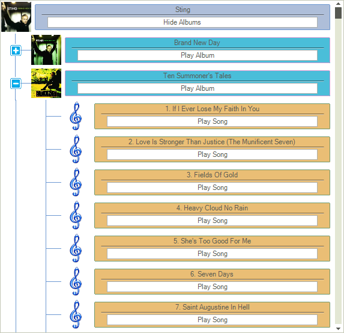

# Custom Nodes

With __RadTreeView__ you can create custom nodes and display them instead of the default ones. This can be done by creating a custom __TreeNodeElement__, which will replace the default one in the __CreateNodeElement__ event handler. This article demonstrates how this approach can be implemented.

To create this example you can first prepare a project by following the steps in [this article]()

1\. First we can create a custom __TreeNodeContentElement__ class which contains the main elements for the custom node. These elements are created and initialized in the __CreateChildElements__ method. Also the __Synchronize__ method is overridden for setting the elements properties in accordance with the corresponding data:

<snippet id='treeview-customnodes-customcontentelement-cs' />
<snippet id='treeview-customnodes-customcontentelement-vb' />

2\. Now we can use the already created __CustomContentElement__ and create a custom __TreeNodeElement__ class. Also here the __Synchronize__ method is overridden in order to set the picture of the node:

<snippet id='treeview-customnodes-customtreenodeelement-cs' />
<snippet id='treeview-customnodes-customtreenodeelement-vb' />

3\. Finally, we can add a little bit more customization by setting some of the __RadTreeView__ properties in the form's Load event handler. And also we need to subscribe to the __CreateNodeElement__ event in order to use the newly created custom nodes:

<snippet id='treeview-customnodes-customnodesload-cs' />
<snippet id='treeview-customnodes-customnodesload-vb' />

# See Also
* [Adding and Removing Nodes]()

* [Bring a Node into View]()

* [Custom Filtering]()

* [Custom Sorting]()

* [Events]()

* [Filtering Nodes]()

* [Simulate TreeList Control with Load on Demand]()

