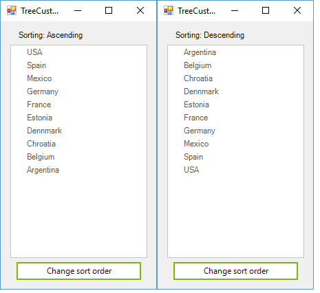

# Custom Sorting

Custom sorting is a flexible mechanism which allows you to replace the default sorting logic with your own logic. The custom sorting operation has higher priority that the default sorting.

To apply your own logic for sorting, you have to create a class which inherits from __TreeNodeComparer__ and override its __Compare__ method, where you can add your custom logic. Here is a sample where we will reverse the sorting of the tree i.e. when sorting *Ascending* we will actually sort in *Descending* order and vice versa. 

#### Creating custom comparer

<snippet id='treeview-treecustomsorting-customsorting3-cs' />
<snippet id='treeview-treecustomsorting-customsorting3-vb' />

Once the comparer is created we have to assign it to the RadTreeView control:

#### Assign the custom comparer

<snippet id='treeview-treecustomsorting-customsorting1-cs' />
<snippet id='treeview-treecustomsorting-customsorting1-vb' />

To test this scenario, you can add a button and a label to the form, where you will change and print the sort order. This will allow you to check whether the sorting is reversed:

<snippet id='treeview-treecustomsorting-customsorting2-cs' />
<snippet id='treeview-treecustomsorting-customsorting2-vb' />

# See Also
* [Adding and Removing Nodes]()

* [Bring a Node into View]()

* [Custom Filtering]()

* [Custom Nodes]()

* [Events]()

* [Filtering Nodes]()

