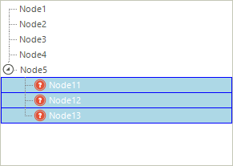

# Formatting Nodes

Similar to RadGridView, RadTreeView uses UI Virtualization. Its visual nodes (TreeNodeElement) are reused by the data nodes (RadTreeNode) which bring increased performance and optimized memory footprint. You can easily format node element by handling the __NodeFormatting__ event. The arguments of this event return the visual Node (and the data Node that is currently assigned to it) that is currently formatted and which you can additionally style.

Each __TreeNodeElement__ contains the following elements:

* __TreeNodeContentElement:__ Used for displaying the text.
* __TreeNodeImageElement:__ Used for displaying image.
* __TreeNodeExpanderItem:__ Displays the Expand/Collapse button
* __TreeNodeLinesContainer:__ Displays the lines which are connecting the nodes.

>important __TreeNodeContentElement__ and __TreeNodeImageElement__ are inheriting [LightVisualElement](). This means that each of these can display separate image, text, fill and border. This allows you customize the node and for example add two images to a single node.


The bellow example shows how you can access and format the main node elements:

{{source=..\SamplesCS\TreeView\WorkingWithNodes\NodeFormatting.cs region=nodeFormatting}} 
{{source=..\SamplesVB\TreeView\WorkingWithNodes\NodeFormatting.vb region=nodeFormatting}}
````C#
        
Bitmap file = SamplesCS.Properties.Resources.file;
private void radTreeView1_NodeFormatting(object sender, TreeNodeFormattingEventArgs e)
{
    if (e.Node.Level > 0)
    {
        e.NodeElement.BorderColor = Color.Blue;
        e.NodeElement.BorderBoxStyle = Telerik.WinControls.BorderBoxStyle.SingleBorder;
        e.NodeElement.BorderGradientStyle = Telerik.WinControls.GradientStyles.Solid;
        e.NodeElement.BackColor = Color.LightBlue;
        e.NodeElement.ContentElement.ForeColor = Color.White;
        e.NodeElement.ImageElement.Image = file;
    }
    else
    {
        e.NodeElement.ResetValue(LightVisualElement.BorderColorProperty, ValueResetFlags.Local);
        e.NodeElement.ResetValue(LightVisualElement.BorderBoxStyleProperty, ValueResetFlags.Local);
        e.NodeElement.ResetValue(LightVisualElement.BorderGradientStyleProperty, ValueResetFlags.Local);
        e.NodeElement.ResetValue(LightVisualElement.BackColorProperty, ValueResetFlags.Local);
        e.NodeElement.ContentElement.ResetValue(LightVisualElement.ForeColorProperty, ValueResetFlags.Local);
        e.NodeElement.ImageElement.ResetValue(LightVisualElement.ImageProperty, ValueResetFlags.Local);
    }
}

````
````VB.NET
Private file As Bitmap = My.Resources.file
Private Sub radTreeView1_NodeFormatting(ByVal sender As Object, ByVal e As TreeNodeFormattingEventArgs)
    If e.Node.Level > 0 Then
        e.NodeElement.BorderColor = Color.Blue
        e.NodeElement.BorderBoxStyle = Telerik.WinControls.BorderBoxStyle.SingleBorder
        e.NodeElement.BorderGradientStyle = Telerik.WinControls.GradientStyles.Solid
        e.NodeElement.BackColor = Color.LightBlue
        e.NodeElement.ContentElement.ForeColor = Color.White
        e.NodeElement.ImageElement.Image = file
    Else
        e.NodeElement.ResetValue(LightVisualElement.BorderColorProperty, ValueResetFlags.Local)
        e.NodeElement.ResetValue(LightVisualElement.BorderBoxStyleProperty, ValueResetFlags.Local)
        e.NodeElement.ResetValue(LightVisualElement.BorderGradientStyleProperty, ValueResetFlags.Local)
        e.NodeElement.ResetValue(LightVisualElement.BackColorProperty, ValueResetFlags.Local)
        e.NodeElement.ContentElement.ResetValue(LightVisualElement.ForeColorProperty, ValueResetFlags.Local)
        e.NodeElement.ImageElement.ResetValue(LightVisualElement.ImageProperty, ValueResetFlags.Local)
    End If
End Sub

````


{{endregion}} 

>caption Figure 1: Nodes formated with the above code.



>note Please note that you should always provide an 'else' clause for each 'if' clause that you have in the implementation of the NodeFormatting event. Skipping this operation will lead to incorrect images applied to the inappropriate nodes.
>


>note It is also important that we are accessing the project resources outside the NodeFormatting event handler. Accessing project resources is a time consuming operation and since NodeFormatting is fired for every visible node, you may experience performance issues if you try to access such resources in the event handler.
>


## Word Wrapping

To enable wrapping text of the nodes in RadTreeView, you can set the __TextWrap__ property of the visual node element in the __NodeFormatting__ event handler.

{{source=..\SamplesCS\TreeView\WorkingWithNodes\NodeFormatting.cs region=nodeFormatting}} 
{{source=..\SamplesVB\TreeView\WorkingWithNodes\NodeFormatting.vb region=nodeFormatting}}
````C#
        
void radTreeView_NodeFormatting(object sender, TreeNodeFormattingEventArgs e)
{
    e.NodeElement.ContentElement.TextWrap = true;
}

````
````VB.NET

Private Sub radTreeView_NodeFormatting(ByVal sender As Object, ByVal e As TreeNodeFormattingEventArgs)
    e.NodeElement.ContentElement.TextWrap = True
End Sub


````


{{endregion}} 

# See Also
* [Adding and Removing Nodes]()

* [Bring a Node into View]()

* [Custom Filtering]()

* [Custom Nodes]()

* [Custom Sorting]()

* [Events]()

