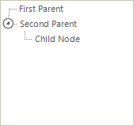
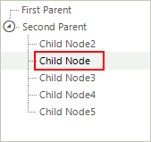

# Reordering Nodes

There are two methods for reordering nodes:

* Using drag and drop the RadTreeView user can reorder the nodes at runtime. In this scenario the developer doesn't have direct control over the node order and the reordering is performed directly by the user. 


* The developer sets the node ordering logic in code.

## Programmatic Reordering

Use the __Insert__ and __Add__ methods of the RadTreeView Nodes collection to reorder nodes programmatically. The code snippet below demonstrates how this is done using the __Add__ method.

{{source=..\SamplesCS\TreeView\WorkingWithNodes\WorkingWithNodes1.cs region=reordering}} 
{{source=..\SamplesVB\TreeView\WorkingWithNodes\WorkingWithNodes1.vb region=reordering}} 

````C#
// Create two parent nodes
RadTreeNode parentNode1 = new RadTreeNode("First Parent");
RadTreeNode parentNode2 = new RadTreeNode("Second Parent");
// Add the parent nodes to tree view's nodes collection
this.radTreeView1.Nodes.Add(parentNode1);
this.radTreeView1.Nodes.Add(parentNode2);
// Create a child node
RadTreeNode childNode = new RadTreeNode("Child Node");
// Add the child node to the first parent's nodes collection
parentNode1.Nodes.Add(childNode);
// Remove the child from the first parent collection and add it to the second parent nodes collection
parentNode1.Nodes.Remove(childNode);
parentNode2.Nodes.Add(childNode);

````
````VB.NET
' Create two parent nodes
Dim parentNode1 As New RadTreeNode("First Parent")
Dim parentNode2 As New RadTreeNode("Second Parent")
' Add the parent nodes to tree view's nodes collection
Me.RadTreeView1.Nodes.Add(parentNode1)
Me.RadTreeView1.Nodes.Add(parentNode2)
' Create a child node
Dim childNode As New RadTreeNode("Child Node")
' Add the child node to the first parent's nodes collection
parentNode1.Nodes.Add(childNode)
' Remove the child from the first parent collection and add it to the second parent nodes collection
parentNode1.Nodes.Remove(childNode)
parentNode2.Nodes.Add(childNode)

````

{{endregion}} 

The highlights of the code snippet are the last three lines where a __RadTreeNode__ is created, added to the "First Parent", then added to the "Second Parent". The result is that the "Child Node" is moved to the nodes collection of the "Second Parent".



To move a node into a collection of multiple nodes instead of adding it to the bottom of the collection, use the __Insert__ method of the __Nodes__ collection. This method takes as parameters the index that the node should be placed in and a reference to the node that will be inserted. The code snippet below shows how to reposition a node using the __Insert__ method.

In the sample code below, two parent nodes are created, a single node is added to the the first parent and multiple nodes are added to the second parent. Then the single child node is inserted to the second parent. The result is that the child node is moved to the "Second Parent" nodes collection. Notice that the nodes collection is zero based so that an index parameter of "1" places the node to the second position in the nodes collection.



{{source=..\SamplesCS\TreeView\WorkingWithNodes\WorkingWithNodes1.cs region=insertingNodes}} 
{{source=..\SamplesVB\TreeView\WorkingWithNodes\WorkingWithNodes1.vb region=insertingNodes}} 

````C#
// Create two parent nodes
RadTreeNode parentNode1 = new RadTreeNode("First Parent");
RadTreeNode parentNode2 = new RadTreeNode("Second Parent");
// Add the parent nodes to tree view's nodes collection
this.radTreeView1.Nodes.Add(parentNode1);
this.radTreeView1.Nodes.Add(parentNode2);
// Create child nodes
RadTreeNode childNode = new RadTreeNode("Child Node");
RadTreeNode childNode2 = new RadTreeNode("Child Node2");
RadTreeNode childNode3 = new RadTreeNode("Child Node3");
RadTreeNode childNode4 = new RadTreeNode("Child Node4");
RadTreeNode childNode5 = new RadTreeNode("Child Node5");
// Add a single child node to the parentNode1 nodes collection and
// multiple nodes to the parentNode2 nodes collection
parentNode1.Nodes.Add(childNode);
parentNode2.Nodes.Add(childNode2);
parentNode2.Nodes.Add(childNode3);
parentNode2.Nodes.Add(childNode4);
parentNode2.Nodes.Add(childNode5);
// Insert the childNode instance to the parentNode2 nodes collection
parentNode1.Nodes.Remove(childNode);
parentNode2.Nodes.Insert(1, childNode);

````
````VB.NET
' Create two parent nodes
Dim parentNode1 As New RadTreeNode("First Parent")
Dim parentNode2 As New RadTreeNode("Second Parent")
' Add the parent nodes to tree view's nodes collection
Me.RadTreeView1.Nodes.Add(parentNode1)
Me.RadTreeView1.Nodes.Add(parentNode2)
' Create child nodes
Dim childNode As New RadTreeNode("Child Node")
Dim childNode2 As New RadTreeNode("Child Node2")
Dim childNode3 As New RadTreeNode("Child Node3")
Dim childNode4 As New RadTreeNode("Child Node4")
Dim childNode5 As New RadTreeNode("Child Node5")
' Add a single child node to the parentNode1 nodes collection and
' multiple nodes to the parentNode2 nodes collection
parentNode1.Nodes.Add(childNode)
parentNode2.Nodes.Add(childNode2)
parentNode2.Nodes.Add(childNode3)
parentNode2.Nodes.Add(childNode4)
parentNode2.Nodes.Add(childNode5)
' Insert the childNode instance to the parentNode2 nodes collection
parentNode1.Nodes.Remove(childNode)
parentNode2.Nodes.Insert(1, childNode)

````

{{endregion}} 


# See Also
* [Adding and Removing Nodes]()

* [Bring a Node into View]()

* [Custom Filtering]()

* [Custom Nodes]()

* [Custom Sorting]()

* [Events]()

