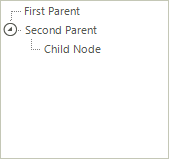
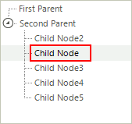

# Reordering Nodes

There are two methods for reordering nodes:

* Using drag and drop the RadTreeView user can reorder the nodes at runtime. In this scenario the developer doesn't have direct control over the node order and the reordering is performed directly by the user. 

* The developer sets the node ordering logic in code.

## Programmatic Reordering

Use the __Insert__ and __Add__ methods of the RadTreeView Nodes collection to reorder nodes programmatically. The code snippet below demonstrates how this is done using the __Add__ method.

<snippet id='treeview-workingwithnodes1-reordering-cs' />
<snippet id='treeview-workingwithnodes1-reordering-vb' />

The highlights of the code snippet are the last three lines where a __RadTreeNode__ is created, added to the "First Parent", then added to the "Second Parent". The result is that the "Child Node" is moved to the nodes collection of the "Second Parent".

To move a node into a collection of multiple nodes instead of adding it to the bottom of the collection, use the __Insert__ method of the __Nodes__ collection. This method takes as parameters the index that the node should be placed in and a reference to the node that will be inserted. The code snippet below shows how to reposition a node using the __Insert__ method.

In the sample code below, two parent nodes are created, a single node is added to the the first parent and multiple nodes are added to the second parent. Then the single child node is inserted to the second parent. The result is that the child node is moved to the "Second Parent" nodes collection. Notice that the nodes collection is zero based so that an index parameter of "1" places the node to the second position in the nodes collection.

<snippet id='treeview-workingwithnodes1-insertingnodes-cs' />
<snippet id='treeview-workingwithnodes1-insertingnodes-vb' />

# See Also
* [Adding and Removing Nodes]()

* [Bring a Node into View]()

* [Custom Filtering]()

* [Custom Nodes]()

* [Custom Sorting]()

* [Events]()

