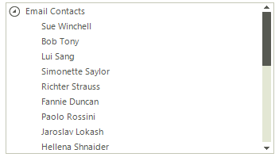
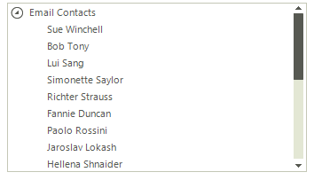
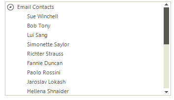
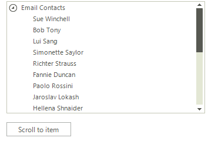

# Scrolling Nodes
 
When the nodes in **RadTreeView** can't fit in the container, a vertical scroll bar appears so that they can be scrolled and later selected. The __EnableMouseWheel__ property controls whether the scrolling behavior is enabled. By default, its value is set to *true* and the nodes can be scrolled by using the mouse wheel.

## Scrolling Modes

The __TreeViewElement__ supports three types of __ScrollModes__:
        

* __Discrete__: Defines scrolling by only one item at a time.
            

* __Smooth__: Sets scrolling by pixel, meaning that an item can be partially visible.
            

* __Deferred__: Does not cause GUI updates until the user finishes the scrolling operation. A tooltip is shown indicating the position to which the view will scroll to.
            
>caption Figure 3: Discrete Scrolling



#### Discrete Scrolling 

````C#
this.radTreeView1.TreeViewElement.Scroller.ScrollMode = ItemScrollerScrollModes.Discrete;
````
````VB.NET
Me.RadTreeView1.TreeViewElement.Scroller.ScrollMode = ItemScrollerScrollModes.Discrete
````

{{endregion}} 

>caption Figure 4: Smooth Scrolling



#### Smooth Scrolling 

````C#
this.radTreeView1.TreeViewElement.Scroller.ScrollMode = ItemScrollerScrollModes.Smooth;
````
````VB.NET
Me.RadTreeView1.TreeViewElement.Scroller.ScrollMode = ItemScrollerScrollModes.Smooth
````

{{endregion}} 
 
>caption Figure 5: Deferred Scrolling



#### Deferred Scrolling 

````C#
this.radTreeView1.TreeViewElement.Scroller.ScrollMode = ItemScrollerScrollModes.Deferred;
````
````VB.NET
Me.RadTreeView1.TreeViewElement.Scroller.ScrollMode = ItemScrollerScrollModes.Deferred

````

{{endregion}} 

      
## KineticScrolling

This feature ensures that the control is ready for modern touch-screen applications. It can be attached by simply setting the __EnableKineticScrolling__ to *true*.
        
>caption Figure 1: Enable Kinetic Scrolling


#### Enabling Kinetic Scrolling 

````C#
this.radTreeView1.EnableKineticScrolling = true;
````
````VB.NET
Me.RadTreeView1.EnableKineticScrolling = True

````

{{endregion}} 

## Programmatically Scrolling

__RadDropDownList__ provides out of the box functionality for programmatically scrolling its content. The available method is __ScrollToItem__ which scrolls to a specific item.
          
>caption Figure 2: Scroll to Item



#### Scroll to Item 

````C#
RadTreeNode lastRootNode = this.radTreeView1.TreeViewElement.Nodes[radTreeView1.Nodes.Count - 1];
this.radTreeView1.TreeViewElement.Scroller.ScrollToItem(lastRootNode);
````
````VB.NET
Dim lastRootNode As RadTreeNode = Me.RadTreeView1.TreeViewElement.Nodes(radTreeView1.Nodes.Count - 1)
Me.RadTreeView1.TreeViewElement.Scroller.ScrollToItem(lastRootNode)
````

{{endregion}} 
 