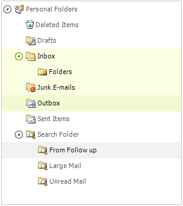
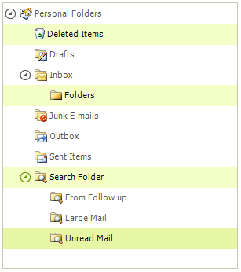

# Selecting Nodes

## Selecting a Single Node

To select a node use the __Selected__ property of __RadTreeNode__. The following example demonstrates how to do it.

<snippet id='treeview-workingwithnodes1-selectednode-cs' />
<snippet id='treeview-workingwithnodes1-selectednode-vb' />

## Selecting Multiple Nodes

To enable the multiple selection the __MultiSelect__ property must be set to *true*. The default value is *false*.

| __Selection__ | __Example__ | __Description__ |
|---------------|-------------|-----------------|
| __Single Selection__ ||The user can select a single node by clicking the node.|
| __Multiple Selection using the Shift key__ ||To select a continuous series of multiple nodes at one time hold __Shift__ and click on a node using the mouse. That will select all nodes between the first selected node and the node that was just clicked. The screenshot shows nodes selected between "Deleted Items" and "Large Mail".|
| __Multiple Selection using the Ctrl key__ ||To select multiple nodes in distributed throughout, hold __Ctrl__ and click on each node using the mouse. That will select the clicked node or unselect the previously selected nodes. The screenshot shows the "Deleted Items" and "Send Items" nodes selected.|

## Selecting Multiple Nodes Programmatically

To select multiple nodes through the API, just set the Selected property of the desired nodes to true. The example below adds four nodes, then selects the last two nodes.

<snippet id='treeview-workingwithnodes1-selectmultinodes-cs' />
<snippet id='treeview-workingwithnodes1-selectmultinodes-vb' />

## SelectedNodeChanged Event

When multiple selection functionality is turned on, the __SelectedNodeChanged__ event will be called twice: first for the previously selected node first and one more time for the newly selected node. In the RadTreeViewEventArgs you can distinguish the two event firings by the __Action__ property which is set to __Unknown__ when the selection is cleared.

<snippet id='treeview-workingwithnodes1-selectednodeevent-cs' />
<snippet id='treeview-workingwithnodes1-selectednodeevent-vb' />

Another approach will be to check the __Selected__ property of the node. If it is true, execute your logic.

<snippet id='treeview-workingwithnodes1-selectedpropertyofthenode-cs' />
<snippet id='treeview-workingwithnodes1-selectedpropertyofthenode-vb' />

# See Also
* [Adding and Removing Nodes]()

* [Bring a Node into View]()

* [Custom Filtering]()

* [Custom Nodes]()

* [Custom Sorting]()

* [Events]()

